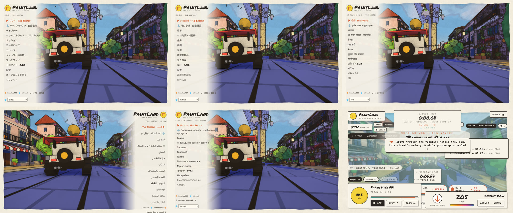
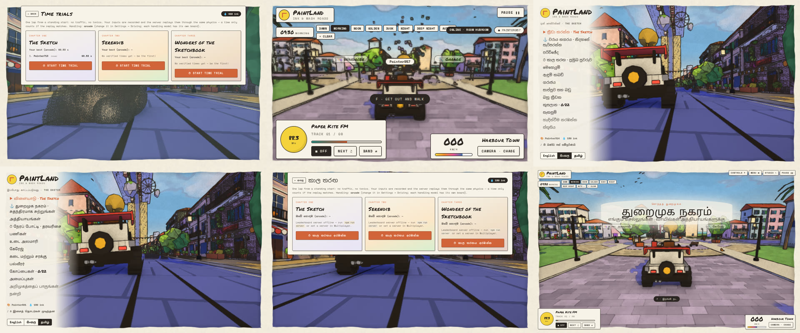
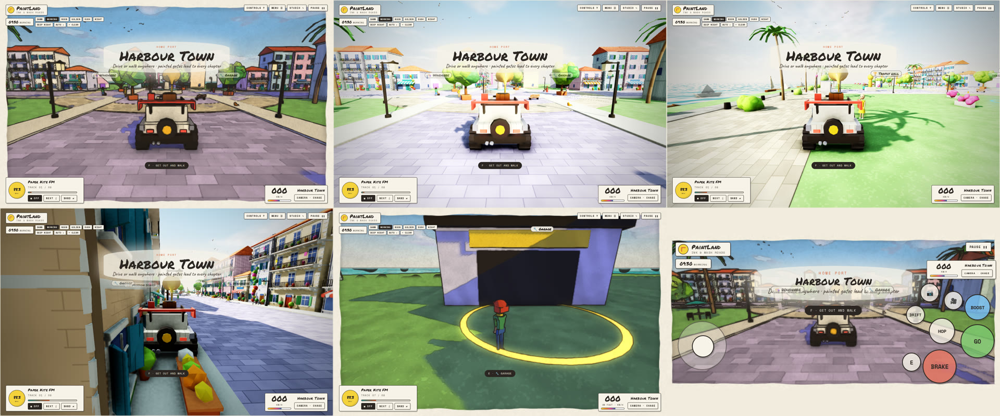

# PaintLand — Game Design & Build Guide

**PaintLand** (working title) is a browser 3D game built with Three.js that looks like a moving watercolour sketchbook. Roads peel off the ground and fold into the sky, up walls, across ceilings and through loops. Driving or walking through floating notes plays each street's melody. You can play alone or with friends, walk around as a customisable character in first or third person, and drive a little rover with a gramophone on its roof.

*Paint the road. Then drive up it.* Prefer it real? One slider turns the sketchbook into a realistically lit world with HDR light, reflections, fog and depth of field.

This repository holds the **design documentation** (in [`docs/`](docs/)) and the **game itself** (in [`src/`](src/)), built with TypeScript, Three.js and Vite.



<details><summary>Milestone 5 screenshots</summary>



</details>

<details><summary>Milestone 4 screenshots</summary>



</details>

<details><summary>Milestone 3 screenshots</summary>


</details>

<details><summary>Milestone 2 screenshots</summary>


</details>

<details><summary>Milestone 1 screenshots</summary>


</details>

## Play it locally

```bash
npm install
npm run dev        # open http://localhost:5173
```

| Command | What it does |
| --- | --- |
| `npm run dev` | Development server with hot reload |
| `npm run build` | Typecheck and build a static site into `dist/` |
| `npm run preview` | Serve the built site |
| `npm test` | Unit tests (road maths for every chapter, rover and walking physics, notes, missions, profile and shop) |
| `npm run typecheck` | TypeScript strict check |
| `npm start` | Builds the game and the run verifier, then serves **everything** on http://localhost:8787: the game, multiplayer, leaderboard, admin panel and analytics (data is kept in `server/data/`) |
| `npm run server` | Multiplayer relay on `ws://localhost:8787` (rooms of 32). Without it, multiplayer still works between tabs of the same browser |
| `node tools/screenshot.mjs` | With `npm run dev` running: renders districts in headless Chromium into `tools/out/` (`SHOTS="serendib:120:golden:storm"`, `STYLE=realistic`, `QUALITY=ultra`, `MENUS="settings/controls,trophies"`, `PHOTO=1`, `INTRO=1`, `MISSION=…`, `WALK=1`) |
| `node tools/landmarks.mjs <chapter> <count>` | Crane shots of every landmark in a chapter (`STYLE=realistic PRESET=golden`) |
| `node tools/drive-test.mjs` | Presses real keys (menu → play, drive, brake, get out, photo mode, realistic handling, lap wrap) and checks for console errors |
| `node tools/net-test.mjs` | Run from the repo root: starts the relay and checks chat, id rewriting, message filtering, and that speed hacks and teleports are dropped |
| `npm run server` | Builds the run verifier (`npm run build:server`) and starts the relay: multiplayer rooms on `ws://localhost:8787` and the time-trial leaderboard on `http://localhost:8787/leaderboard` |
| `node tools/race-test.mjs` | Run from the repo root: two browser windows join a room over the relay, one starts a live race, both drive the lap, and both must show two finishes verified by server re-simulation |
| `node tools/trial-test.mjs` | Run from the repo root: starts the relay, drives a full time-trial lap in the browser, checks that the server re-simulated and ranked it, and that a faked time is rejected |
| `node tools/brand-test.mjs` | Milestone 9, with `npm run server` and the dev server running: the loading screen, the menu footer, the secret word, a wrong and a right login, the dashboard, a sponsor upload, and the watercolour boards in Harbour Town, the city (and blimp) and on a chapter road. Screenshots go to `tools/out/brand-*.png` |
| `node tools/m8-test.mjs` | Milestone 8: the city as a sketch, painting a district (wash and fireworks), the paper map and a fast travel from it, the night perahera, and the daily brushstrokes screen. Screenshots go to `tools/out/m8-*.png` |
| `node tools/city-test.mjs` | Drives from Harbour Town into Serendib City through the road sign, opens a loot chest, finds a secret pot, lands the "Over the bus" stunt, charges a drift mini-turbo, starts a city mission and opens the mission board. Screenshots go to `tools/out/city-*.png` |
| `node tools/hub-test.mjs` | Drives and walks around Harbour Town with real keys, opens the garage from its ring, resumes, drives through a chapter gate, and checks the touch controls on a phone-sized screen |

Needs a browser with WebGL2 (any current Chrome, Edge, Firefox or Safari).

### Controls

| | Driving | On foot |
| --- | --- | --- |
| Move | **W/S** throttle/brake · **A/D** steer | **WASD** |
| **Space** | Hop | Jump |
| **Shift** | Boost | Sprint |
| **Ctrl** | Drift | Walk slowly |
| **F / E** | Get out (when slow) | Get in (near the rover) |
| **C / V** | Chase · Low · Drone · Cinema · Cockpit | Third ↔ first person |
| Mouse | — | Look (click to lock the pointer) |

Also: **M** map (free roam) · **P** photo mode · **.** / **,** gear up / down (realistic handling, manual gearbox) · **Q** drink the selected tonic · **Z** next tonic · **G** wave · **Enter** chat (multiplayer) · **scroll** zoom · **[ ]** field of view · **T** radio · **N** next song · **B** change station · **1–7** time of day · **8** auto day · **9** weather (clear → cloudy → fog → rain → storm) · **H** honk · **R** respawn · **`** or **F2** Studio panel · **U** hide HUD · **Esc** pause. Gamepads work too (stick, RT/LT, A hop, X boost, B drift, Y get in/out).

Every key can be rebound in **Menu → Settings → Controls**. On phones and tablets, touch controls appear on the first touch: a floating stick, GO / BRAKE pedals, HOP, BOOST, DRIFT, E, camera and photo buttons, and drag-to-look.

## Releases and deployment (CI/CD)

Every push to GitHub runs these workflows (`.github/workflows/`):

| Workflow | When | What it does |
| --- | --- | --- |
| **CI** | every push and pull request | Typecheck, 116 unit tests, web and server builds, a live smoke test of the server (game page, branding, a refused admin login, analytics, leaderboard), the desktop shell's security tests, and `npm audit` for the game and the desktop app |
| **CodeQL** | pushes to `main`, pull requests, weekly | GitHub's static security analysis (extended queries) over the game, server and desktop code |
| **Web deploy and previews** | pushes to `main`; pull requests | Publishes the game to GitHub Pages. Every pull request from this repository gets its own preview at `…/previews/pr-<number>/`, linked in a comment and deleted when the pull request closes. Forks never get a write token |
| **Desktop app (Windows)** | every push (and `v*` tags) | Builds **PaintLand-Setup-x.y.z.exe** (installer) and **PaintLand-Portable-x.y.z.exe**, checks the security fuses in the built exe, writes `SHA256SUMS.txt`, and signs build provenance. Download them from the run's **Artifacts**. A tag like `v1.0.0` also creates a **GitHub Release** with the files |
| **Server image** | pushes to `main`, tags | Builds `ghcr.io/lasakaru/paintland` (the one-process server: game + multiplayer + leaderboard + admin + analytics) with an SBOM and provenance |
| **Dependabot** | weekly | Update pull requests for npm (game and desktop), GitHub Actions and the Docker base image |

**One-time setup on GitHub**
1. Settings → Pages → *Deploy from a branch* → `gh-pages` / root (the first `main` deploy creates the branch).
2. If you host the game server, add the repository **variables** `PAINTLAND_API_BASE` (e.g. `https://play.helao2.com`) and `PAINTLAND_SERVER_WS` (e.g. `wss://play.helao2.com`). The web and desktop builds then use it for the admin panel, branding, sponsors and multiplayer.
3. Optional, recommended: code signing. Buy a Windows code-signing certificate and add the **secrets** `WIN_CSC_LINK` (the .pfx, base64-encoded) and `WIN_CSC_KEY_PASSWORD`. The desktop workflow then signs the exe automatically. Unsigned exes work, but Windows SmartScreen warns "unknown publisher" until they are signed.

**Release a version:** `git tag v1.0.0 && git push origin v1.0.0` publishes the installer, the portable exe and the checksums as a GitHub Release.

**Check a download:** compare `certutil -hashfile PaintLand-Setup-1.0.0.exe SHA256` with `SHA256SUMS.txt`, or run `gh attestation verify PaintLand-Setup-1.0.0.exe -R lasakaru/paintland` to prove it was built by this repository's workflow.

**Host the server:** `docker run -d -p 8787:8787 -v paintland-data:/data -e ADMIN_PASSWORD='a long passphrase' ghcr.io/lasakaru/paintland:main`. Put it behind HTTPS (Caddy, nginx or a cloud load balancer). The image runs as a non-root user and keeps its data in `/data`.

**How the desktop app is locked down** (`desktop/`):
- The game runs in a sandboxed, context-isolated renderer with no Node.js.
- It is served from a private `app://` scheme out of the ASAR archive, never `file://`, with a strict Content-Security-Policy: no inline or eval'd scripts, no plugins, no framing, no form posts.
- It cannot navigate away, open windows or attach webviews. Links open in the system browser, and only `https:` and `mailto:`.
- Every permission request is refused except pointer lock, fullscreen and copying to the clipboard.
- There is a single instance, no menu and no DevTools in release builds.
- Electron fuses are flipped in the exe: no RunAsNode, no `NODE_OPTIONS`, no `--inspect`, ASAR integrity checking, app loaded only from the ASAR, and cookie encryption on.

 · "Presented by HelaO2"

| System | Status | Where |
| --- | --- | --- |
| **One application**: `npm start` builds the game and serves everything from one Node process on one port: the game itself, multiplayer rooms, the ranked leaderboard, the admin panel API, analytics and uploaded logos. In development, Vite forwards `/api` to the relay (`npm run server`) | ✅ | `server/relay.mjs`, `server/admin.mjs`, `vite.config.ts` |
| **HelaO2 presents**: the loading screen paints the HelaO2 logo in like a watercolour wash (a spreading reveal, rough pigment edges, soft colour blooms), then "presents", then PaintLand | ✅ | `src/ui/Hud.ts`, `src/styles/main.css` |
| **Secret admin panel**: type **kumara** on any menu screen (on touch screens, tap the PaintLand logo 5 times) to open the login. The server checks the email and password against a salted scrypt hash. Wrong attempts are rate-limited, sessions last 12 hours, and the password can be changed in the panel | ✅ | `src/ui/Admin.ts` |
| **Dashboard**: players (all time, today, 7 days, returning), online now and multiplayer rooms, sessions and average length, hours played, 30-day charts of players and hours, sponsor board views and visits with visit rate, plus breakdowns by chapter, area, time by place, language, device, graphics quality, frame rate, missions, trophies and menu link clicks. Exportable as JSON | ✅ | `server/admin.mjs` |
| **Branding and links**: company name, website, loading-screen words, sponsor contact email, company logo upload, how often the company logo appears, "Your brand here" boards on or off, and room size. Buy me a coffee, Fund the game, Become a sponsor and up to 8 more links appear in the main menu's footer | ✅ | `src/ui/Menu.ts` |
| **Sponsors**: upload logos (PNG, JPEG or WebP, shrunk in the browser) with a name, link and weight, and switch them on or off. They appear in the menu footer and on boards in the world | ✅ | `src/ui/Admin.ts` |
| **Logos as watercolour**: every logo is repainted before it goes into the world. White backgrounds are keyed out, pigment thins and granulates, a wet bleed spreads around the shapes, edges darken where paint pools, and it all sits on warm paper with blooms and an inked border. The painted picture then goes through the game's own paint shader (light, shadows, outlines) | ✅ | `src/brand/Watercolour.ts`, `src/render/PaintMaterial.ts` |
| **Boards in the world**: 37 billboards and banners in Serendib City, 6 in Harbour Town and one every ~700 m along every chapter road, plus a paper blimp towing the company banner over the city. Logos are picked at random with the admin's weights. Empty slots say "Your brand here · support@helao2.com". On foot, press **E** at a board to visit the sponsor | ✅ | `src/brand/BrandBoards.ts`, `src/brand/BrandSpots.ts` |
| **Moderation**: recent chat (in memory only), ban and unban player names (banned names cannot join rooms or chat) | ✅ | `server/admin.mjs` |
| **Privacy**: statistics are anonymous (a random id per browser, no names, no IP addresses stored), and players can turn them off in Settings → Accessibility | ✅ | `src/net/Analytics.ts` |

**Admin login.** The email is `lasantha@helao2.com`. The password you chose is stored only as a salted hash, not in plain text. It is short, so please change it in the panel (🔒 Security) before going live. You can also set `ADMIN_EMAIL` and `ADMIN_PASSWORD` when starting the server. The secret word only opens the login page; the server does the real check.

## What was new in milestone 8 · "Colour the City"

| System | Status | Where |
| --- | --- | --- |
| **Colour the City**: Serendib City's 8 districts start as pencil sketches (the paint shader washes them to grey paper inside each district). Finding a district's golden pots, landing its stunts, opening its chests, photographing its sights and finishing missions there paints it in, blotch by blotch. At 60 % the district is restored with a fanfare, fireworks and 300 ink. Driving into a district shows its name and paint bar | ✅ | `src/gameplay/Restoration.ts`, `src/render/PaintMaterial.ts` |
| **Paper map and minimap**: press **M** (or tap the minimap) for a hand-painted map showing districts and their paint, roads, the lake and sea, service rings, stunts, today's chests, found pots, mission targets, other players and the parade. A heading-up minimap sits in the corner and keeps mission targets pinned to its rim. Driving near a named place **discovers** it (+25 ink), and discovered places are fast-travel points (not during timed missions) | ✅ | `src/ui/MapView.ts` |
| **Daily brushstrokes** (Menu → ☀ Today): three small challenges a day, the same for everyone, picked from 12 (drive, drift, mini-turbos, stunts, chests, photos, missions, notes, walking, discoveries, the perahera). Finishing all three grows a streak and opens a chest that gets better every day of the streak | ✅ | `src/gameplay/Challenges.ts` |
| **Photo hunt**: 10 sights across both areas, including the night parade. A photo counts when the sight is near the middle of the frame and in range | ✅ | `src/gameplay/PhotoHunt.ts` |
| **The night perahera**: after dark, a festival procession of three lit elephants in embroidered caparisons, flag bearers, drummers and fire dancers with flaming torches walks a loop of Pettah's streets. Traffic waits for it, and festival drums (davul, thammattama, cymbals) grow louder as you get close. Fireworks go up over it, and riding along for 20 seconds earns the perahera blessing once a night | ✅ | `src/world/Perahera.ts`, `src/audio/AudioEngine.ts` |
| **Online safety**: a chat filter is on by default (it masks insults, including digit swaps and stretched letters). Chat can be set to filtered, unfiltered or off. Other players can be blocked from the multiplayer screen, which hides their chat and avatar. Invite links join the room straight away | ✅ | `src/net/ChatFilter.ts`, `src/ui/Menu.ts` |
| **8 new trophies** for keen eyes, daredevils, streaks, the festival and painting the whole city | ✅ | `src/gameplay/Trophies.ts` |
| Fixes: stunt ramps now aim at reachable landing circles, and loot-only items are no longer given away free with a new profile | ✅ | `src/gameplay/FreeRoam.ts`, `src/gameplay/Profile.ts` |

Every new string is translated into all 24 languages. Place names, mission text and photo-hunt sights are still English data, like the chapter missions.

## What was new in milestone 7 · "Serendib City"

| System | Status | Where |
| --- | --- | --- |
| **Serendib City**: a second, much larger free-roam area, 1.3 × 1.15 km. Reach it from the main menu (🏙 Serendib City) or by driving through the road sign on Harbour Town's east side. It has 7 districts: a skyscraper downtown with the Lotus Tower, an old-town market, a lake park with elephants, a stunt park, suburbs, a beach with a pier and lighthouse, and tea hills topped by a white stupa. The streets have working traffic (cars stop for you and for each other), 28 pedestrians, traffic lights, bus stops, billboards, food carts, market umbrellas, statues and parked cars | ✅ | `src/world/City.ts`, `src/models/CityProps.ts` |
| **More fun to drive**: hold **Ctrl** while turning to drift and charge a mini-turbo, then release to fire it (a super turbo if fully charged; the sparks show the charge). There are boost pads, and 6 named stunt jumps with landing circles, slow motion in the air and a pulled-back camera. Landing a stunt pays ink, more the first time. Bumping into traffic makes a crunch | ✅ | `src/gameplay/FreeRoam.ts`, `src/core/Game.ts` |
| **Secrets and loot**: 25 golden paint pots are hidden across both areas (a 🗝 counter shows found / total), plus 21 loot chests in 4 tiers that refill daily. Chests roll Common, Rare, Epic or Legendary loot, with a reveal card and a sound that grows with rarity. Loot-only items can't be bought | ✅ | `src/gameplay/Loot.ts` |
| **New customisation**: vehicle decals (stripes, polka dots, flames, a chequered flag), a lip spoiler and a big wing, and underglow in 4 colours; crown, helmet and flower-garland hats; capes and wings | ✅ | `src/models/Vehicles.ts`, `src/models/Human.ts`, `src/gameplay/Profile.ts` |
| **Mission chains that flow**: 4 stories with 3 missions each (Tuk-Tuk Tales, The Painter's Palette, Stunt School, City Secrets). Each one unlocks the next. Steps can be: drive somewhere, collect, checkpoints against the clock, timed delivery, land a stunt, take a photo, or go on foot. Glowing beacons, a compass arrow with distance, and an objective card guide you. Start missions from the city mission board ring or Menu | ✅ | `src/gameplay/CityMissions.ts` |
| **Soundscape**: layered nature sounds that follow where you are. Waves near the coast, wind in the leaves and birdsong (4 species) in parks and hills, gulls at the beach, crickets and frogs at night, a city hum and distant horns downtown. A new station, 101.4 Serendib Beat (hand drums and marimba), joins the others. Music ducks and opens with speed and when paused. The engine has a sub layer and intake roar, tyres screech in drifts, and there are sounds for doors, boosts, checkpoints, loot, secrets, stunt cheers, fanfares and menu clicks. An **Ambience** volume slider is in Settings → Audio | ✅ | `src/audio/Ambience.ts`, `src/audio/AudioEngine.ts` |
| Multiplayer works in the city (the validator knows the city bounds), and every new string is translated into all 24 languages | ✅ | `server/validate.mjs`, `src/core/locales/` |

## What was new in milestone 6 · "Around the world"

| System | Status | Where |
| --- | --- | --- |
| **24 languages**: English, 简体中文, हिन्दी, Español, العربية, Français, বাংলা, Português, Русский, اردو, Bahasa Indonesia, Deutsch, 日本語, Türkçe, 한국어, Tiếng Việt, Italiano, فارسی, Polski, Nederlands, ไทย, Kiswahili, தமிழ், සිංහල. Each language is its own file, loaded only when chosen. The game detects the browser's language, and a picker (each language named in its own script) is on the splash screen, the main menu and Settings | ✅ | `src/core/i18n.ts`, `src/core/locales/` |
| **Right-to-left** layout for Arabic, Urdu and Persian: the page direction flips and the menu moves to the right-hand side | ✅ | `src/styles/main.css` |
| **Fonts for every script**: Noto for Latin/Cyrillic, Devanagari, Bengali, Arabic, Thai, Sinhala, Tamil and CJK, with regional Han glyphs for Japanese and Korean. Fonts are split by unicode-range, so only the pieces in use are downloaded | ✅ | `src/main.ts` |
| **Live multiplayer races** (Menu → 🏁 Live race): anyone in a room starts a race and every player gets the same chapter and a synced countdown. Your live position shows while you drive, and finishes are re-simulated by the server and marked ✓ verified on a shared results board | ✅ | `src/core/Game.ts`, `src/net/Net.ts`, `server/relay.mjs` |

All translations are first drafts and need review by native speakers before release. Tests check that every language covers every string with the same placeholders and key letters.

## What was new in milestone 5 · "On the board"

| System | Status | Where |
| --- | --- | --- |
| **Ranked time trials** (Menu → ⏱ Time trials): one lap from a standing start with no traffic or tonics. Every input is recorded at 60 Hz (4 bytes a step). The server **replays the run through the same simulation** and ranks the time only if the replay matches, so faked times, edited inputs and speed hacks are rejected. Each chapter has a board per handling model, alongside your local bests and ghost | ✅ | `src/gameplay/TrialSim.ts`, `src/server/verify.ts`, `server/relay.mjs`, `src/net/Leaderboard.ts` |
| **Multiplayer in Harbour Town**: players in the same room see each other's cars and characters driving and walking around the hub, with name tags, chat and waves | ✅ | `src/net/RemotePlayers.ts`, `src/core/Game.ts` |
| **Languages: English, සිංහල (Sinhala), தமிழ் (Tamil)**, chosen on the splash screen, the main menu or Settings → Accessibility. Detected from the browser on first run. Menus, prompts, tips, hub labels and trial messages are translated; district names and poems are still English | ✅ | `src/core/i18n.ts` |

The Sinhala and Tamil text is a first draft and should be reviewed by native speakers before release.

## What was new in milestone 4 · "Home port"

| System | Status | Where |
| --- | --- | --- |
| **Harbour Town**, a free-roam hub (Menu → ⚓ Harbour Town). Drive or walk anywhere: a cobbled plaza with a fountain, two avenues of shops and houses, cafés and gardens, a harbour with boats, a pier and a lighthouse, and townsfolk who stroll and wave | ✅ | `src/world/Hub.ts` |
| **Free-roam physics**: a car with bicycle-model steering, slip, hops and wall bumps, and a walker with camera-relative movement that slides along walls. This is the "free driving" mode that complements ribbon driving | ✅ | `src/gameplay/FreeRoam.ts` |
| **Hub services**: glowing rings for the Garage, Wardrobe, Shop, Mission board and Trophy hall. Press E to open them, and Resume brings you back where you stood. **Painted gates** to each chapter: drive through one to start that chapter | ✅ | `src/world/Hub.ts`, `src/core/Game.ts` |
| **Touch controls** for phones and tablets, with a HUD layout adjusted for small screens | ✅ | `src/ui/TouchControls.ts` |
| **Onboarding tips**: short, one-time hints for driving, notes, hopping, boost, gravity, walking and settings, worded for keyboard or touch | ✅ | `Game.onboarding` |
| **Graphics reset recovery**: if the browser drops the WebGL context, the game saves the profile, shows a notice, and reloads when the context comes back | ✅ | `src/core/Game.ts` |
| **Multiplayer validation** (server and client): speed, position, teleport and NaN checks, chat and name cleaning, and strikes that drop repeat offenders | ✅ | `server/validate.mjs`, `server/relay.mjs`, `src/net/Net.ts` |
| **Determinism tests**: the same inputs give bit-identical rover results, in arcade and realistic handling. Ghosts and future server re-simulation of races depend on this | ✅ | `tests/milestone4.test.ts` |

## What was new in milestone 3 · "Real light"

| System | Status | Where |
| --- | --- | --- |
| **Art style: Watercolour ↔ Illustrated ↔ Realistic**, and a Realism slider that blends between them. The realistic look has smooth normals on round shapes, sun, sky and ground lighting, specular highlights and sky reflections, glass and car paint, wet roads that mirror the sky in rain, headlights after dark, HDR, ambient occlusion, sun shafts, height fog with a sun-tinted haze, filmic tone mapping, vignette, FXAA and cinematic depth of field. It also has a physically lit sky with silver-lined clouds and a sea with waves, Fresnel reflections and a sun glint | ✅ | `src/render/` |
| **Graphics quality: Low / Medium / High / Ultra / Custom**, detected for the device on first run. Settings: render scale, auto-balance to 60 fps, pixel ratio, FXAA, frame cap, draw distance, shadows (off to 4096², distance, soft edges), ambient occlusion, bloom, sun shafts, HDR. Live fps and draw-call readout | ✅ | `src/render/StudioSettings.ts`, Settings → Graphics |
| **Settings screen** with tabs for Graphics, Look, Controls, Driving, Audio and Accessibility | ✅ | `src/ui/Menu.ts` |
| **Controls:** rebind any action (press a key), mouse and stick sensitivity, invert Y, stick deadzone, gamepad vibration | ✅ | `src/core/Input.ts` |
| **Realistic handling:** a 6-speed automatic or manual gearbox with rpm and a torque curve, air drag and engine braking, less steering at speed, and tyres that slide past their grip. Also steering sensitivity, smoothing and lane assist, auto-cruise on or off, km/h or mph. Engine sound follows rpm; gear and rpm show on the speed card | ✅ | `src/gameplay/RoverController.ts`, `src/core/Options.ts` |
| **Weather:** clear, cloudy, fog, rain and storm, with lightning flashes and rolling thunder. Can change by itself | ✅ | `src/world/Environment.ts` |
| **Photo mode (P):** frozen world, free camera, field of view, roll, auto or manual focus, background blur, time, weather, exposure and realism. Saves a PNG at 1×, 2× or 4K | ✅ | `src/ui/PhotoMode.ts` |
| **Ghosts:** your best clean lap per chapter is saved and raced as a see-through car | ✅ | `src/gameplay/Ghost.ts` |
| **Trophies:** 22 trophies with progress bars, ink rewards and lifetime stats (distance, air time, top speed, time upside down…) | ✅ | `src/gameplay/Trophies.ts`, Menu → Trophies |
| **Particles:** tyre smoke, dust on earth roads, rain spray, sparks, boost exhaust, confetti and fireflies. **Birds** circle overhead by day and bats by night | ✅ | `src/render/Particles.ts`, `src/world/Wildlife.ts` |
| **Accessibility:** colour-vision assist (protan, deutan, tritan), HUD size, reduced motion, calm lighting | ✅ | Settings → Accessibility |

## What was new in milestone 2 · "Serendib and the Wonders"

| System | Status | Where |
| --- | --- | --- |
| **Three chapters** chosen from the menu: *The Sketch* (8 districts), *Serendib*, a Sri Lanka chapter (Galle Face Green, Lotus Tower Spiral, Sigiriya Lion Rock, Ella Tea Hills, Nine Arch Bridge with a moving blue train, Mirissa Palms), and *Wonders of the Sketchbook* (Great Wall, Colosseum, Taj Mahal, Machu Picchu, Christ the Redeemer on Corcovado, Chichen Itza, Petra) | ✅ | `src/world/chapters/`, `src/world/dress/` |
| Landmark models: Lotus Tower, Sigiriya with lion paws and a fresco pocket, Nine Arch Bridge, train, stupa, elephant, tuk-tuk, oruwa boat, kites, tea factory, Great Wall with watchtowers, Colosseum arcades, Taj Mahal and Mughal garden, Inca terraces and llamas, the Redeemer, El Castillo, the Treasury, camels | ✅ | `src/models/Landmarks*.ts` |
| More detailed world: five house styles with hip roofs, shutters, balconies, awnings and doors; branching trees with fruit and pots; palms; street props (bikes, scooters, bins, fountains, café tables, cats, bunting); themed hills (tea, jungle, rock, sandstone, snow); richer clouds | ✅ | `src/models/` |
| Road paving styles drawn in the shader (slabs, cobbles, asphalt, stone, planks, earth) with manholes and chalk doodles; brick, tile, plank, stone, leaf, tea, thatch, grass, sandstone and marble surface patterns | ✅ | `src/render/PaintMaterial.ts` |
| Game menu over a live gameplay background: an autopilot demo filmed by a cinematic director (chase, orbit, flyby, drone and landmark crane shots). First launch plays a letterboxed story intro with subtitles | ✅ | `src/ui/Menu.ts`, `src/camera/Director.ts`, `src/gameplay/Autopilot.ts` |
| Character wardrobe: 8 hair styles, 5 tops including sari, 4 bottoms including sarong, 6 hats, glasses, back items, colours and height, with a turntable preview | ✅ | `src/models/Human.ts`, Wardrobe screen |
| Garage: 6 vehicles (rover, tuk-tuk, coupé, buggy, van, scooter), each with its own handling, plus body and trim paint | ✅ | `src/models/Vehicles.ts` |
| Inventory and shop: ink currency, catalogue of vehicles, clothes and tonics, a tonic bag, a saved profile | ✅ | `src/gameplay/Profile.ts` |
| 18 missions (6 per chapter) from pedestrians with a "!": note runs, phrase seals, split times, air time, timed deliveries, landmark visits, races against a rival, stamp hunts, boost challenges | ✅ | `src/gameplay/Missions.ts` |
| A living world: pedestrians who wave, AI traffic you can bump into, race rivals | ✅ | `src/gameplay/Population.ts` |
| Multiplayer: join a room by name, see other players' vehicles and characters with name tags, chat, wave. Works across browser tabs with no server, or across machines through the relay | ✅ | `src/net/`, `server/relay.mjs` |

## What was built in milestone 1 · "The Sketch"

| System | Status | Where |
| --- | --- | --- |
| Watercolour renderer: toon + coloured shadows, ink lines with line boil, Kuwahara colour bleed, pigment edge darkening, wet edges, granulation, paper, glow, torn sketchbook border, rain, speed lines | ✅ | `src/render/` |
| Studio panel with every art value live, 8 vibe presets, auto resolution | ✅ | `src/ui/Studio.ts`, `src/render/StudioSettings.ts` |
| Ribbon road engine: turtle track builder with exact up vectors, 0.5 m lookup table, chunked procedural road mesh | ✅ | `src/road/` |
| Chapter 1 route: 8 districts, 3 km — town street, tower climb, ceiling street, corkscrew, drop, spiral over the sea, loop, twist | ✅ | `src/world/chapters/sketch.ts`, `src/world/Districts.ts` |
| Road-gravity rover: throttle, brake, cruise floor, drift, hop, boost, kerbs, ramps, speed pads | ✅ | `src/gameplay/RoverController.ts` |
| On-foot human: walk / jog / sprint / jump on road gravity (walls and ceilings too), get in and out of the rover | ✅ | `src/gameplay/HumanController.ts` |
| Cameras: chase, low, drone, cinema, cockpit, third person, first person, title orbit — with collision and a water clamp | ✅ | `src/camera/CameraRig.ts` |
| Procedural models: rover (3 roof loads), character (4 hair styles, hats, outfits), houses, towers, stalls, kiosks, trees, lamps, flower arches, bunting, lighthouse, islands, clouds, crayons | ✅ | `src/models/` |
| Seeded district dressing in the road frame (houses hang upside down on the ceiling automatically) | ✅ | `src/world/Decorator.ts` |
| Notes from melodies, beat-quantised music box, phrases and the Songbook, tonics with drawbacks, crates, time trial with splits | ✅ | `src/gameplay/Collectibles.ts`, `src/core/Game.ts` |
| Procedural radio (3 stations in the district's key and tempo), engine, wind, rain, SFX | ✅ | `src/audio/AudioEngine.ts` |
| Time of day (7 presets + auto) and rain | ✅ | `src/world/Environment.ts` |
| HUD and menus as paper cards: title, intro, pause, controls, radio, Songbook, speed card with gravity compass | ✅ | `src/ui/` |
| More hubs (one per chapter), live head-to-head races, commissioned music, hand-made model pass, more languages and translated district text | ⏳ next milestones | see [docs/12](docs/12-production-plan.md) |

## How to read this

| # | Document | What's inside |
| --- | --- | --- |
| 01 | [Reference analysis](docs/01-reference-analysis.md) | A second-by-second breakdown of the reference gameplay video, a HUD teardown, the systems it reveals, and the bugs we must avoid |
| 02 | [Vision and pillars](docs/02-vision-and-pillars.md) | Pitch, design pillars, audience, game modes, what "AAA" means for a browser game, non-goals |
| 03 | [Art direction and watercolour renderer](docs/03-art-direction-watercolor.md) | Visual rules, palette, the render pass chain, every Studio slider, vibe presets, time of day, weather |
| 04 | [World and level design](docs/04-world-and-level-design.md) | Chapters, districts, walkable hubs, the spline road system, level rules, NPCs, prop kit, streaming |
| 05 | [Player controllers](docs/05-player-controllers.md) | Pawn system, gravity service, human character (first and third person), rover (ribbon and free driving), camera system, full control bindings |
| 06 | [Gameplay systems](docs/06-gameplay-systems.md) | Notes and Songbook, tonics (buff + drawback), scoring, time trial, rule modifiers, progression, on-foot activities, story |
| 07 | [Audio and music](docs/07-audio-and-music.md) | Audio layers, adaptive music, beat quantisation, radio, spatial audio, mixing |
| 08 | [Customisation and creation](docs/08-customization-and-creation.md) | Character creator, garage, Studio panel, every setting, accessibility, photo mode, road/track creator, saves |
| 09 | [Multiplayer and online](docs/09-multiplayer.md) | Modes, server architecture, netcode, parties, matchmaking, ghosts, anti-cheat, safety, scaling |
| 10 | [UI, UX and HUD](docs/10-ui-ux-hud.md) | Screen flow, driving and on-foot HUD, menus, touch layout, localisation, onboarding |
| 11 | [Technical architecture](docs/11-technical-architecture.md) | Stack, module map, frame budgets, quality tiers, asset pipeline, streaming, determinism, testing, deployment |
| 12 | [Production plan](docs/12-production-plan.md) | Phases and milestones, team, content targets, risks, KPIs, release checklist, legal, first 30 days |

Reference material:
- [`docs/reference/frames/`](docs/reference/frames/) — contact sheets from the reference video (1 frame per second, 6 frames per sheet) and full-resolution HUD frames.
- [`docs/reference/original-build-plan.md`](docs/reference/original-build-plan.md) — the first build plan this guide expands on.

## The short version

1. **Look:** simple low-poly toon models + screen passes (ink lines, Kuwahara colour bleed, edge darkening, paper grain, torn border). Every value is a live slider.
2. **Road:** one spline per route with an up-vector per point; gravity follows the road, so walls, ceilings and loops just work.
3. **Controllers:** one pawn system — a human character (first/third person) and a rover (ribbon driving on routes, free driving in hubs) — sharing input, gravity and cameras.
4. **Music:** notes on the road are a melody; each pickup plays on the beat; phrases fill a Songbook; the radio is the backing band.
5. **Toys:** time of day, weather, vibes, rules, camera, character, car — all changeable at any time.
6. **Together:** authoritative room servers with a shared deterministic sim; hubs for 32, races for 8, ghosts and daily boards for everyone.
7. **Order:** look test → road and rover → music → on foot → vertical slice → multiplayer → alpha → beta → 1.0 → seasons.

## Status

| Area | Status |
| --- | --- |
| Design documentation | ✅ Complete (v1) |
| Phase 0 · Look test | ✅ Done |
| Phase 1 · Road and rover | ✅ Done |
| Phase 2 · Music core | ✅ Done (procedural radio; commissioned music later) |
| Phase 3 · On-foot prototype | ✅ Done on ribbon roads (hubs next) |
| Phase 4 · Vertical slice | 🚧 In progress: 3 chapters, menus, customisation, missions |
| Phase 5 · Multiplayer | ✅ Tab and relay rooms, hub multiplayer, peer interpolation, chat, ghosts, server-side validation, determinism tests, leaderboards verified by re-simulation |
| Phase 6 · Alpha systems | 🚧 Photo mode, trophies, full settings, accessibility v1, quality tiers, Hub 1 (Harbour Town), Hub 2 (Serendib City: open world, loot, secrets, mission chains, stunts, Colour the City, map, perahera), daily challenges, chat safety, soundscape, touch controls, onboarding and 24 languages done; closed alpha next |
