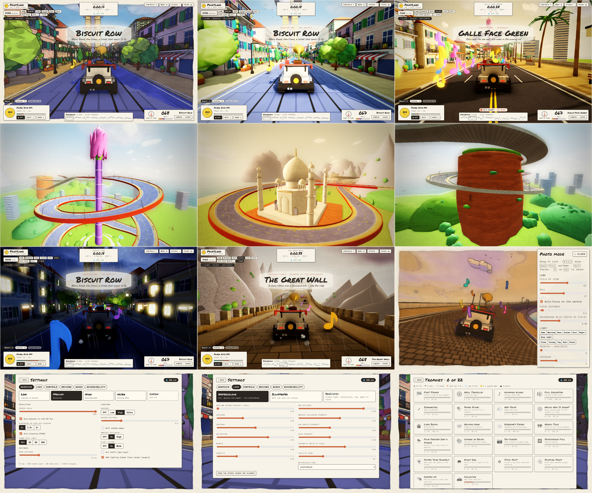
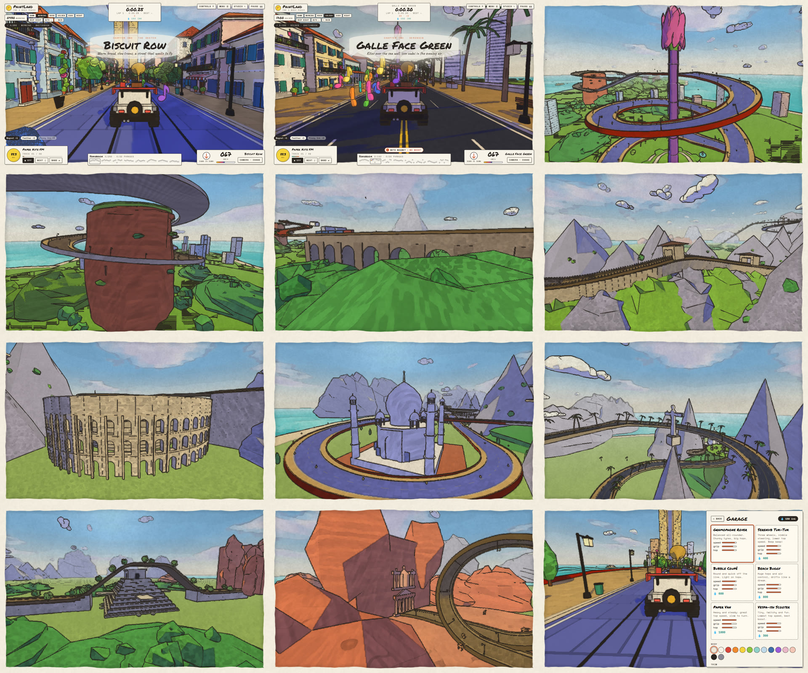
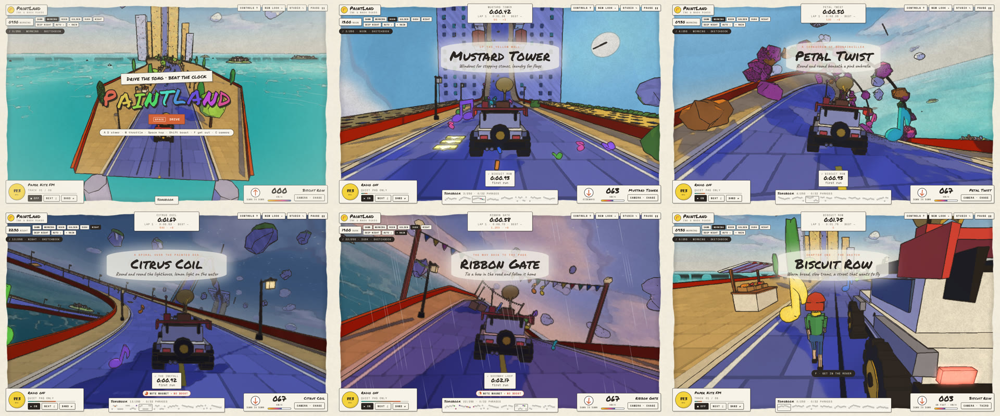

# PaintLand — Game Design & Build Guide

**PaintLand** (working title) is a browser 3D game built with Three.js that looks like a moving watercolour sketchbook. Roads peel off the ground and fold into the sky, up walls, across ceilings and through loops. Driving or walking through floating notes plays each street's melody. You can play alone or with friends, walk around as a customisable character in first or third person, and drive a little rover with a gramophone on its roof.

*Paint the road. Then drive up it.* Prefer it real? One slider turns the sketchbook into a realistically lit world with HDR light, reflections, fog and depth of field.

This repository holds the **design documentation** (in [`docs/`](docs/)) and the **game itself** (in [`src/`](src/)), built with TypeScript, Three.js and Vite.



<details><summary>Milestone 2 screenshots</summary>



</details>

<details><summary>Milestone 1 screenshots</summary>



</details>

## Play it locally

```bash
npm install
npm run dev        # open http://localhost:5173
```

| Command | What it does |
| --- | --- |
| `npm run dev` | Development server with hot reload |
| `npm run build` | Typecheck and build a static site into `dist/` |
| `npm run preview` | Serve the built site |
| `npm test` | Unit tests (road maths for every chapter, rover and walking physics, notes, missions, profile and shop) |
| `npm run typecheck` | TypeScript strict check |
| `npm run server` | Multiplayer relay on `ws://localhost:8787` (rooms of 32). Without it, multiplayer still works between tabs of the same browser |
| `node tools/screenshot.mjs` | With `npm run dev` running: renders districts in headless Chromium into `tools/out/` (`SHOTS="serendib:120:golden:storm"`, `STYLE=realistic`, `QUALITY=ultra`, `MENUS="settings/controls,trophies"`, `PHOTO=1`, `INTRO=1`, `MISSION=…`, `WALK=1`) |
| `node tools/landmarks.mjs <chapter> <count>` | Crane shots of every landmark in a chapter (`STYLE=realistic PRESET=golden`) |
| `node tools/drive-test.mjs` | Presses real keys (menu → play, drive, brake, get out, photo mode, realistic handling, lap wrap) and checks for console errors |
| `node tools/net-test.mjs` | Starts the relay and checks chat, id rewriting and message filtering |

Needs a browser with WebGL2 (any current Chrome, Edge, Firefox or Safari).

### Controls

| | Driving | On foot |
| --- | --- | --- |
| Move | **W/S** throttle/brake · **A/D** steer | **WASD** |
| **Space** | Hop | Jump |
| **Shift** | Boost | Sprint |
| **Ctrl** | Drift | Walk slowly |
| **F / E** | Get out (when slow) | Get in (near the rover) |
| **C / V** | Chase · Low · Drone · Cinema · Cockpit | Third ↔ first person |
| Mouse | — | Look (click to lock the pointer) |

Also: **P** photo mode · **.** / **,** gear up / down (realistic handling, manual gearbox) · **Q** drink the selected tonic · **Z** next tonic · **G** wave · **Enter** chat (multiplayer) · **scroll** zoom · **[ ]** field of view · **T** radio · **N** next song · **B** change station · **1–7** time of day · **8** auto day · **9** weather (clear → cloudy → fog → rain → storm) · **H** honk · **R** respawn · **`** or **F2** Studio panel · **U** hide HUD · **Esc** pause. Gamepads work too (stick, RT/LT, A hop, X boost, B drift, Y get in/out).

Every key can be rebound in **Menu → Settings → Controls**.

## What is new in milestone 3 · "Real light"

| System | Status | Where |
| --- | --- | --- |
| **Art style: Watercolour ↔ Illustrated ↔ Realistic**, and a Realism slider that blends between them. The realistic look has smooth normals on round shapes, sun, sky and ground lighting, specular highlights and sky reflections, glass and car paint, wet roads that mirror the sky in rain, headlights after dark, HDR, ambient occlusion, sun shafts, height fog with a sun-tinted haze, filmic tone mapping, vignette, FXAA and cinematic depth of field. It also has a physically lit sky with silver-lined clouds and a sea with waves, Fresnel reflections and a sun glint | ✅ | `src/render/` |
| **Graphics quality: Low / Medium / High / Ultra / Custom**, detected for the device on first run. Settings: render scale, auto-balance to 60 fps, pixel ratio, FXAA, frame cap, draw distance, shadows (off to 4096², distance, soft edges), ambient occlusion, bloom, sun shafts, HDR. Live fps and draw-call readout | ✅ | `src/render/StudioSettings.ts`, Settings → Graphics |
| **Settings screen** with tabs for Graphics, Look, Controls, Driving, Audio and Accessibility | ✅ | `src/ui/Menu.ts` |
| **Controls:** rebind any action (press a key), mouse and stick sensitivity, invert Y, stick deadzone, gamepad vibration | ✅ | `src/core/Input.ts` |
| **Realistic handling:** a 6-speed automatic or manual gearbox with rpm and a torque curve, air drag and engine braking, less steering at speed, and tyres that slide past their grip. Also steering sensitivity, smoothing and lane assist, auto-cruise on or off, km/h or mph. Engine sound follows rpm; gear and rpm show on the speed card | ✅ | `src/gameplay/RoverController.ts`, `src/core/Options.ts` |
| **Weather:** clear, cloudy, fog, rain and storm, with lightning flashes and rolling thunder. Can change by itself | ✅ | `src/world/Environment.ts` |
| **Photo mode (P):** frozen world, free camera, field of view, roll, auto or manual focus, background blur, time, weather, exposure and realism. Saves a PNG at 1×, 2× or 4K | ✅ | `src/ui/PhotoMode.ts` |
| **Ghosts:** your best clean lap per chapter is saved and raced as a see-through car | ✅ | `src/gameplay/Ghost.ts` |
| **Trophies:** 22 trophies with progress bars, ink rewards and lifetime stats (distance, air time, top speed, time upside down…) | ✅ | `src/gameplay/Trophies.ts`, Menu → Trophies |
| **Particles:** tyre smoke, dust on earth roads, rain spray, sparks, boost exhaust, confetti and fireflies. **Birds** circle overhead by day and bats by night | ✅ | `src/render/Particles.ts`, `src/world/Wildlife.ts` |
| **Accessibility:** colour-vision assist (protan, deutan, tritan), HUD size, reduced motion, calm lighting | ✅ | Settings → Accessibility |

## What was new in milestone 2 · "Serendib and the Wonders"

| System | Status | Where |
| --- | --- | --- |
| **Three chapters** chosen from the menu: *The Sketch* (8 districts), *Serendib*, a Sri Lanka chapter (Galle Face Green, Lotus Tower Spiral, Sigiriya Lion Rock, Ella Tea Hills, Nine Arch Bridge with a moving blue train, Mirissa Palms), and *Wonders of the Sketchbook* (Great Wall, Colosseum, Taj Mahal, Machu Picchu, Christ the Redeemer on Corcovado, Chichen Itza, Petra) | ✅ | `src/world/chapters/`, `src/world/dress/` |
| Landmark models: Lotus Tower, Sigiriya with lion paws and a fresco pocket, Nine Arch Bridge, train, stupa, elephant, tuk-tuk, oruwa boat, kites, tea factory, Great Wall with watchtowers, Colosseum arcades, Taj Mahal and Mughal garden, Inca terraces and llamas, the Redeemer, El Castillo, the Treasury, camels | ✅ | `src/models/Landmarks*.ts` |
| More detailed world: five house styles with hip roofs, shutters, balconies, awnings and doors; branching trees with fruit and pots; palms; street props (bikes, scooters, bins, fountains, café tables, cats, bunting); themed hills (tea, jungle, rock, sandstone, snow); richer clouds | ✅ | `src/models/` |
| Road paving styles drawn in the shader (slabs, cobbles, asphalt, stone, planks, earth) with manholes and chalk doodles; brick, tile, plank, stone, leaf, tea, thatch, grass, sandstone and marble surface patterns | ✅ | `src/render/PaintMaterial.ts` |
| Game menu over a live gameplay background: an autopilot demo filmed by a cinematic director (chase, orbit, flyby, drone and landmark crane shots). First launch plays a letterboxed story intro with subtitles | ✅ | `src/ui/Menu.ts`, `src/camera/Director.ts`, `src/gameplay/Autopilot.ts` |
| Character wardrobe: 8 hair styles, 5 tops including sari, 4 bottoms including sarong, 6 hats, glasses, back items, colours and height, with a turntable preview | ✅ | `src/models/Human.ts`, Wardrobe screen |
| Garage: 6 vehicles (rover, tuk-tuk, coupé, buggy, van, scooter), each with its own handling, plus body and trim paint | ✅ | `src/models/Vehicles.ts` |
| Inventory and shop: ink currency, catalogue of vehicles, clothes and tonics, a tonic bag, a saved profile | ✅ | `src/gameplay/Profile.ts` |
| 18 missions (6 per chapter) from pedestrians with a "!": note runs, phrase seals, split times, air time, timed deliveries, landmark visits, races against a rival, stamp hunts, boost challenges | ✅ | `src/gameplay/Missions.ts` |
| A living world: pedestrians who wave, AI traffic you can bump into, race rivals | ✅ | `src/gameplay/Population.ts` |
| Multiplayer: join a room by name, see other players' vehicles and characters with name tags, chat, wave. Works across browser tabs with no server, or across machines through the relay | ✅ | `src/net/`, `server/relay.mjs` |

## What was built in milestone 1 · "The Sketch"

| System | Status | Where |
| --- | --- | --- |
| Watercolour renderer: toon + coloured shadows, ink lines with line boil, Kuwahara colour bleed, pigment edge darkening, wet edges, granulation, paper, glow, torn sketchbook border, rain, speed lines | ✅ | `src/render/` |
| Studio panel with every art value live, 8 vibe presets, auto resolution | ✅ | `src/ui/Studio.ts`, `src/render/StudioSettings.ts` |
| Ribbon road engine: turtle track builder with exact up vectors, 0.5 m lookup table, chunked procedural road mesh | ✅ | `src/road/` |
| Chapter 1 route: 8 districts, 3 km — town street, tower climb, ceiling street, corkscrew, drop, spiral over the sea, loop, twist | ✅ | `src/world/chapters/sketch.ts`, `src/world/Districts.ts` |
| Road-gravity rover: throttle, brake, cruise floor, drift, hop, boost, kerbs, ramps, speed pads | ✅ | `src/gameplay/RoverController.ts` |
| On-foot human: walk / jog / sprint / jump on road gravity (walls and ceilings too), get in and out of the rover | ✅ | `src/gameplay/HumanController.ts` |
| Cameras: chase, low, drone, cinema, cockpit, third person, first person, title orbit — with collision and a water clamp | ✅ | `src/camera/CameraRig.ts` |
| Procedural models: rover (3 roof loads), character (4 hair styles, hats, outfits), houses, towers, stalls, kiosks, trees, lamps, flower arches, bunting, lighthouse, islands, clouds, crayons | ✅ | `src/models/` |
| Seeded district dressing in the road frame (houses hang upside down on the ceiling automatically) | ✅ | `src/world/Decorator.ts` |
| Notes from melodies, beat-quantised music box, phrases and the Songbook, tonics with drawbacks, crates, time trial with splits | ✅ | `src/gameplay/Collectibles.ts`, `src/core/Game.ts` |
| Procedural radio (3 stations in the district's key and tempo), engine, wind, rain, SFX | ✅ | `src/audio/AudioEngine.ts` |
| Time of day (7 presets + auto) and rain | ✅ | `src/world/Environment.ts` |
| HUD and menus as paper cards: title, intro, pause, controls, radio, Songbook, speed card with gravity compass | ✅ | `src/ui/` |
| Walkable hubs, touch controls, authoritative server, commissioned music, hand-made model pass | ⏳ next milestones | see [docs/12](docs/12-production-plan.md) |

## How to read this

| # | Document | What's inside |
| --- | --- | --- |
| 01 | [Reference analysis](docs/01-reference-analysis.md) | A second-by-second breakdown of the reference gameplay video, a HUD teardown, the systems it reveals, and the bugs we must avoid |
| 02 | [Vision and pillars](docs/02-vision-and-pillars.md) | Pitch, design pillars, audience, game modes, what "AAA" means for a browser game, non-goals |
| 03 | [Art direction and watercolour renderer](docs/03-art-direction-watercolor.md) | Visual rules, palette, the render pass chain, every Studio slider, vibe presets, time of day, weather |
| 04 | [World and level design](docs/04-world-and-level-design.md) | Chapters, districts, walkable hubs, the spline road system, level rules, NPCs, prop kit, streaming |
| 05 | [Player controllers](docs/05-player-controllers.md) | Pawn system, gravity service, human character (first and third person), rover (ribbon and free driving), camera system, full control bindings |
| 06 | [Gameplay systems](docs/06-gameplay-systems.md) | Notes and Songbook, tonics (buff + drawback), scoring, time trial, rule modifiers, progression, on-foot activities, story |
| 07 | [Audio and music](docs/07-audio-and-music.md) | Audio layers, adaptive music, beat quantisation, radio, spatial audio, mixing |
| 08 | [Customisation and creation](docs/08-customization-and-creation.md) | Character creator, garage, Studio panel, every setting, accessibility, photo mode, road/track creator, saves |
| 09 | [Multiplayer and online](docs/09-multiplayer.md) | Modes, server architecture, netcode, parties, matchmaking, ghosts, anti-cheat, safety, scaling |
| 10 | [UI, UX and HUD](docs/10-ui-ux-hud.md) | Screen flow, driving and on-foot HUD, menus, touch layout, localisation, onboarding |
| 11 | [Technical architecture](docs/11-technical-architecture.md) | Stack, module map, frame budgets, quality tiers, asset pipeline, streaming, determinism, testing, deployment |
| 12 | [Production plan](docs/12-production-plan.md) | Phases and milestones, team, content targets, risks, KPIs, release checklist, legal, first 30 days |

Reference material:
- [`docs/reference/frames/`](docs/reference/frames/) — contact sheets from the reference video (1 frame per second, 6 frames per sheet) and full-resolution HUD frames.
- [`docs/reference/original-build-plan.md`](docs/reference/original-build-plan.md) — the first build plan this guide expands on.

## The short version

1. **Look:** simple low-poly toon models + screen passes (ink lines, Kuwahara colour bleed, edge darkening, paper grain, torn border). Every value is a live slider.
2. **Road:** one spline per route with an up-vector per point; gravity follows the road, so walls, ceilings and loops just work.
3. **Controllers:** one pawn system — a human character (first/third person) and a rover (ribbon driving on routes, free driving in hubs) — sharing input, gravity and cameras.
4. **Music:** notes on the road are a melody; each pickup plays on the beat; phrases fill a Songbook; the radio is the backing band.
5. **Toys:** time of day, weather, vibes, rules, camera, character, car — all changeable at any time.
6. **Together:** authoritative room servers with a shared deterministic sim; hubs for 32, races for 8, ghosts and daily boards for everyone.
7. **Order:** look test → road and rover → music → on foot → vertical slice → multiplayer → alpha → beta → 1.0 → seasons.

## Status

| Area | Status |
| --- | --- |
| Design documentation | ✅ Complete (v1) |
| Phase 0 · Look test | ✅ Done |
| Phase 1 · Road and rover | ✅ Done |
| Phase 2 · Music core | ✅ Done (procedural radio; commissioned music later) |
| Phase 3 · On-foot prototype | ✅ Done on ribbon roads (hubs next) |
| Phase 4 · Vertical slice | 🚧 In progress: 3 chapters, menus, customisation, missions |
| Phase 5 · Multiplayer | 🚧 First pass: tab and relay rooms, peer interpolation, chat, ghosts (no server authority yet) |
| Phase 6 · Alpha systems | 🚧 Photo mode, trophies, full settings, accessibility v1, quality tiers done; hubs and touch next |
