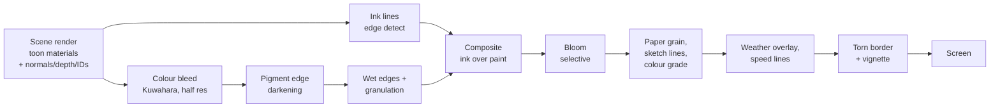

# 03 · Art Direction and the Watercolour Renderer

The painted look comes from **stacked screen passes over simple toon-shaded models**, not from painted textures. Get the passes right and a box with a roof reads as an illustration. This chapter defines the rules artists follow and the passes the graphics programmer builds.

## 1. Visual rules

| Topic | Rule |
| --- | --- |
| **Shapes** | Chunky low-poly, slightly crooked. Nothing perfectly straight or symmetrical: roofs tilt 1–3°, lamps lean, windows are uneven. Trees are faceted blobs (8–30 faces). |
| **Scale** | Slightly toy-like: doors 2.2 m, cars 20 % oversized wheels, characters 1.5–1.7 m with big heads (1 : 5.5 head-to-body). |
| **Colour** | Flat fills with 2–3 tone bands. Pastel walls, terracotta roofs, lime greens, cobalt and teal water, cream paper. |
| **Shadow** | Always coloured, never grey: blue-violet by day, indigo by night, rose at golden hour. Large, soft-edged, like a wash. |
| **Lines** | Sepia-black ink. Thick on silhouettes (2–3 px at 1080p), thin on inner creases (1 px). Lines "boil" (redraw with a small jitter) 8–24 times per second. |
| **Paper** | Everything sits on cream paper. Highlights let the paper show through; darks never reach pure black. |
| **Frame** | A torn, deckled paper edge round the viewport; UI sits on the page colour outside it. |
| **Text in world** | Hand-lettered marker style, always on a paper plate or with an ink outline so it reads on any background. |
| **Motion** | Paper things flutter, ink things drip, water is drawn with scribble lines. Animations can run "on twos" (12 fps) for props and characters while the camera stays at 60. |

### Master palette (starting point)

| Role | Hex | Use |
| --- | --- | --- |
| Paper | `#F1ECDD` | page, UI cards, highlights |
| Ink | `#2B2622` | outlines, titles |
| Road | `#9FA3D6` | road slabs (lavender blue) |
| Road line | `#F2D33B` | centre dashes |
| Terracotta | `#D2643A` | roofs, kerbs, primary buttons |
| Leaf | `#8CC63F` | trees, bushes |
| Sea | `#37C3C0` | water |
| Shadow (day) | `#6B6FB8` | cast shadow tint |
| Flower | `#D94A86` | bougainvillea, accents |
| Lemon | `#F4E04D` | lemons, notes, glow |
| Brass | `#C9A24A` | gramophone, lamps |
| Night ink | `#1E2350` | night shadow and sky |

Each district gets a **sub-palette of 6–8 colours** drawn from the master palette so districts feel different but belong together.

## 2. Rendering pipeline

The scene is drawn once. Every painterly effect is a full-screen pass. On WebGPU some passes merge into one compute pass.

### 2.1 Scene pass — toon materials

- One shared custom toon material for the whole world (keeps shaders compiled once).
- Inputs: base colour (vertex colour or 1 palette texture per kit), 3-step light ramp, shadow tint colour (from time of day), rim-light amount, emissive mask.
- In shadowed areas add a **hatch/brush noise term** in world space so shadows look brushed, not flat.
- Output extra buffers in the same pass (multiple render targets): view normals, linear depth, and an **object ID** (for clean outlines between touching objects of the same colour).
- Characters and the rover get an optional **inverted-hull outline** for a bolder silhouette than the screen pass gives.

### 2.2 Ink lines

- Edge detection (Sobel or Roberts cross) on depth, normals and object ID.
- **Line boil:** offset sample positions with a noise texture that changes on a timer (8–24 fps, slider). Reduced-motion mode sets it to 0.
- **Weight by distance:** lines thin out with depth so the far city does not turn black.
- **Pencil under-drawing:** faint, slightly offset second lines (construction lines) at 20–30 % opacity.

### 2.3 Colour bleed and pigment

- **Kuwahara filter** (4 or 8 sectors, radius 3–6 px) at half resolution turns flat fills into brush patches.
- **Edge darkening:** darken pixels where colour changes sharply — this is the "pigment pools at the edge of a wash" effect that sells watercolour.
- **Wet edges:** displace UVs with low-frequency noise so fills slightly overrun the ink lines (colour bleeding past the line, like the reference).
- **Granulation:** multiply by a paper-grain texture weighted by pigment darkness.

### 2.4 Paper, grade and frame

- Multiply by a tiling scanned paper texture (2 variants: cold-press and hot-press).
- Colour grade by a 3D LUT per vibe preset (see §4).
- **Torn border:** noise-thresholded alpha mask blending to page colour; its thickness is a slider; it pulses slightly inward on big landings and respawns.
- **Speed lines:** manga-style radial lines at the screen edge above 150 km/h or while boosting (off in reduced motion).

### 2.5 Pass settings (all exposed in the Studio panel)

| Group | Setting | Range | Default |
| --- | --- | --- | --- |
| Camera | Field of view | 60–110° | 80 |
| Camera | Render resolution | 50–100 % | auto |
| Ink | Ink strength | 0–1 | 0.85 |
| Ink | Line weight | 0.5–3 px | 1.6 |
| Ink | Line crispness | 0–1 | 0.6 |
| Ink | Line boil rate | 0–24 fps | 12 |
| Ink | Pencil under-drawing | 0–1 | 0.25 |
| Paint | Colour bleed (Kuwahara radius) | 0–8 px | 4 |
| Paint | Edge darkening | 0–1 | 0.5 |
| Paint | Wet edges | 0–1 | 0.35 |
| Paint | Granulation | 0–1 | 0.4 |
| Paper | Paper grain | 0–1 | 0.5 |
| Paper | Sketchbook border | 0–1 | 0.6 |
| Glow | Bloom strength | 0–2 | 0.8 |
| Grade | Saturation | 0.5–1.5 | 1.0 |
| Grade | Warmth | −1–1 | 0.1 |
| Motion | Speed lines | on/off + intensity | on, 0.6 |
| Motion | Camera roll in loops | 0–100 % | 100 |

Settings save per device and can be shared as a short code ("look code").

## 3. Hand-made details that sell it

- **Sky:** a painted dome texture per time band plus 20–40 drifting billboard cloud cards in 3 layers.
- **Water:** flat teal, a scrolling hand-drawn caustic line texture, white foam doodles along shores, scribble ripples when it rains, simple paper-boat wakes.
- **Road:** lavender paving tiles with random per-tile tint, chalk doodles, tyre marks that stay for 30 s, wet shine in rain.
- **Foliage:** faceted canopies with 2–3 flat tones; leaves and petals fall as paper cut-outs.
- **Titles:** 3D block letters placed in the world at district entrances (as in the reference) **plus** a readable 2D title card with a paper backing.
- **Toy debris in the sky:** crayons, pencils, book spines, rings, boots, cubes, paper planes — slowly rotating, instanced.

## 4. Vibe presets ("new look")

A vibe is a named bundle of Studio settings + LUT + music filter. The status chip shows the active vibe. Players can make and share their own.

| Vibe | Look | Music filter |
| --- | --- | --- |
| **Sketchbook** (default) | Balanced ink and paint | none |
| **Postcard** | Warmer, less ink, strong paper, rounded border | light tape warble |
| **Nocturne** | Blue grade, strong bloom, thin ink | low-pass, more reverb |
| **Dreamy** | High bleed, soft lines, pastel grade | chorus, slower |
| **Velocity** | Crisp ink, speed lines always on, high contrast | +5 % tempo, punchier drums |
| **Architect** | Blueprint: heavy lines, light paint, grid paper | minimal |
| **Maritime** | Teal/orange grade, wind streaks | sea ambience up |
| **Risograph** | 2–3 ink colours, halftone grain | bitcrushed a little |
| **Charcoal** | Almost monochrome, heavy grain | piano only |

## 5. Time of day and weather

Each preset is a set of numbers (sky colours, sun angle and colour, shadow tint, fog, bloom, LUT) blended over 2 seconds. The clock shows game time and a named band.

| Band | Game time | Sky top → horizon | Sun | Shadow tint | Extras |
| --- | --- | --- | --- | --- | --- |
| Dawn | 05:00–06:30 | lilac → peach | pale pink, 8° | violet | mist over the sea |
| Early | 06:30–08:00 | pale blue → gold | soft gold, 18° | blue | birds start |
| Morning | 08:00–11:00 | sky blue → cream | warm white, 30° | blue-violet | café sounds |
| Noon | 11:00–15:00 | cyan → white | white, 70° | cool blue, short | heat shimmer |
| Golden | 15:00–18:00 | amber → rose | orange, 15° | purple | long shadows, bloom up |
| Dusk | 18:00–20:00 | purple → coral | magenta, 3° | indigo | lamps switch on |
| Night | 20:00–02:00 | navy → teal | moon, 40° | deep indigo | lit windows, headlights, stars |
| Deep night | 02:00–05:00 | black-blue → navy | dim moon | ink | fireflies, very quiet music |

- **Auto:** full day in 12 real minutes (slider 4–60 min). The **calm lighting** option stops fast cycling and never blends faster than 5 s.
- **Weather:** Clear, Rain, Storm (rain + thunder flashes as ink splats), Fog (paper-white fog), Snow (paper confetti snow), Wind (leaves, streaks). Any weather combines with any time.
- **Rain look:** diagonal ink streaks in screen space, darker wet wash, puddle light patches, scribble ripples on water, wipers sound in the cockpit view.
- **Night lights:** street lamps and windows are emissive + bloom. Only the 4–8 lights nearest the player are real lights; the rest are glow sprites.

## 6. Characters in the painted style

- Humans are **paper-doll stylised**: flat-shaded, strong silhouette, 3–5 k triangles, hair as a few big shapes, faces with painted eyes and simple mouth shapes (texture swap or blend shapes).
- Clothing colours come from the master palette; the character creator offers only palette-safe colours plus a free picker that is automatically softened to fit the style.
- Outlines use the inverted hull on characters so they always read against busy backgrounds.
- Animals (cats, panda, birds, dogs, snails) follow the same rules.

## 7. Art production rules

- Every asset is reviewed in-engine with the full pass stack, at dawn, noon and night, in rain, before approval.
- No unique textures unless approved: vertex colour or a shared 256 × 256 palette texture per kit.
- Triangle budgets: small prop 50–400, house 800–2,500, hero tower 5 k, rover 5–8 k, character 3–5 k, hub landmark 15 k.
- Style bible: one page per asset family with do/don't examples, maintained by the art director.
