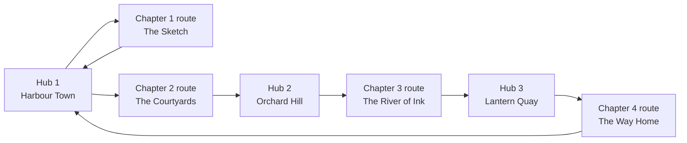

# 04 · World and Level Design

## 1. World structure

The world is a **floating sketchbook archipelago** over a painted sea. It has two kinds of space:

| Space | What it is | Movement | Example |
| --- | --- | --- | --- |
| **Ribbon routes** | One continuous road per chapter that peels off the ground and folds through the sky. Linear, fast, musical. | Rover (ribbon mode) and on foot | A street that climbs a tower, runs across a ceiling, then corkscrews down |
| **Hubs** | Open, walkable towns on islands. Non-linear, slow, social. | On foot and rover (free mode) | A harbour town with a plaza, café, garage, record shop and rooftops |
| **Pockets** | Small hidden spaces off the routes: interiors, rooftop gardens, secret loops | On foot | A tiny bookshop inside a floating book |

Each route starts and ends at a hub. Hubs are also the multiplayer meeting places ([09](09-multiplayer.md)).

## 2. The road as a spline (the level backbone)

Everything on a route is placed relative to one spline. Build the road tool first; every district is then "decorate this stretch".

### Control point data

| Field | Meaning |
| --- | --- |
| Position | World position |
| Up vector | Which way is "down" for anything standing on the road at this point |
| Width | Road width (6–18 m) |
| Bank | Extra roll for banked curves |
| District id | Which district this point belongs to |
| Surface | Paving, wood, glass, paper, water-slide, cobbles (changes sound, grip, particles) |
| Tags | Tram rails, kerb style, guard rail, lamp spacing, pavement width, no-hop zone, checkpoint |
| Gravity zone | Normal (road gravity) or world gravity (for deliberate jumps/gaps) |

### Rules for building the road

- Interpolate with **centripetal Catmull-Rom**; build frames with **parallel transport** so loops and corkscrews never flip.
- Build a **lookup table** every 0.5 m: distance → position, tangent, up, right, width, surface. The car, camera, notes, NPCs and props all query this table.
- Generate the mesh procedurally in chunks of 100 m: paving slabs, kerbs, pavements, guard rails on high sections, and an underside with thickness so the road reads as folded paper.
- Centre lines, tram rails, speed pads and painted tutorial text are separate strips that follow the same frames.
- Invisible side walls on all high or inverted sections; soft "paper rail" bounce, never a hard stop.

## 3. Chapters and districts

All names below are original placeholders. The reference game's names must not be used.

### Chapter 1 · The Sketch (vertical slice, ≈ 3 min lap)

| # | District | Road trick | Props and mood | Key / tempo |
| --- | --- | --- | --- | --- |
| 1 | **Biscuit Row** | Straight pier street, gentle climb, tram rails | Pastel houses, café stall, balconies, lemon trees, pedestrians, cats | C major, 90 bpm, warm |
| 2 | **Mustard Tower** | Quarter-pipe up a tower face to 90° | Tall yellow block, vines, laundry lines, window boxes | G major, 96 bpm |
| 3 | **Topsy Terrace** | Runs across an inverted wall/ceiling | Windows as floor tiles, upside-down houses, Ferris wheel above | E minor, 100 bpm, dreamy |
| 4 | **Petal Twist** | Two-turn corkscrew under flower arches | Pink/orange flower arches on black vines, petals | D major, 104 bpm |
| 5 | **The Inkfall** | 70° plunge between water chutes | Teal slides, splash spray, lighthouse ahead | A minor, 110 bpm, tense |
| 6 | **Citrus Coil** | Wide banked spiral over the sea | Islands with tiny towns, paper boats, crates, crayons in the sky | F major, 92 bpm, breezy |
| 7 | **Doorway Loop** | Full vertical loop | Blue-door kiosks, book-spine pillars, giant pencil | B♭ major, 98 bpm |
| 8 | **Ribbon Gate** | Half-twist (Möbius-style) back to the hub | Bunting arch, lanterns, fireworks at night | C major, 100 bpm, finale |

### Chapters 2–4 (outline)

| Chapter | Theme | New road tricks | New mechanic introduced |
| --- | --- | --- | --- |
| 2 · The Courtyards | Walled gardens, fountains, tiled courtyards, orchards | Stair-step road, split roads (choose a lane), road through a building | Branching routes; on-foot sections inside courtyards |
| 3 · The River of Ink | A river that flows up into the sky, bridges, mills, night markets | Road on the water surface, waterfall climb, road that "unfolds" as you drive | Paper boat vehicle; rain-only paths |
| 4 · The Way Home | Memory districts from chapters 1–3, rearranged; a final flight over the whole world | Road that you paint yourself in real time (brush-road finale) | Paint-the-road ability |

Target: **28 districts**, lap lengths 3–5 minutes per chapter.

## 4. Hubs (open, walkable)

| Hub | Size | Contents |
| --- | --- | --- |
| **Harbour Town** (Hub 1) | ≈ 400 × 400 m | Plaza with fountain, garage (car customisation), wardrobe shop (character), record shop (radio stations, songs), photo booth, post office (postcards = story), pier, lighthouse, rooftops you can climb |
| **Orchard Hill** (Hub 2) | ≈ 500 × 300 m | Terraced orchards, windmill, picnic spots, music stage where players can perform together |
| **Lantern Quay** (Hub 3) | ≈ 350 × 350 m | Night market, canals (paper boats), lantern festival events |

Hub rules:
- **Landmark visible from everywhere** (lighthouse, windmill, lantern tower) for navigation.
- **Every 20–30 m something to do:** a character, a collectible, a sit spot, an instrument, a view point.
- **Vertical layers:** street, balconies/rooftops, sky walkways. Climbable routes are marked with painted yellow handholds.
- **Car access:** main streets are driveable (free-drive mode); alleys, stairs and rooftops are foot-only.
- **Ribbon on-ramps:** painted arches where a hub street becomes a ribbon route. Entering one hands the car from free-drive to ribbon mode.

## 5. Level-building rules (routes)

1. **Show the future.** From almost every point the player sees a later part of the road in the sky.
2. **New thing every 10–20 seconds:** a title, a trick, a prop theme, a pickup pattern.
3. **Rest after every big trick:** 8–10 seconds of easy road.
4. **Teach once, then twist:** a trick appears first in a safe form, then later combined (loop + hop, corkscrew + pickups).
5. **Note lines draw the melody** and also show the ideal racing line.
6. **Density:** street districts have props every 3–6 m on both sides; sky districts go sparse and let the sea and islands do the work.
7. **Background layers:** floating islands with tiny towns, floating rocks, hanging paper strips, crayons and book spines, distant cloud cards — all instanced or billboards.
8. **Readability at speed:** road edges always contrast with what is beyond them; nothing important sits within 2 m of the road edge at 150 km/h+.
9. **Camera-safe dressing:** every tall prop near the road carries a "camera blocker" tag so the camera can fade it ([05](05-player-controllers.md#5-camera-system)).
10. **Safety net:** if anything falls off, fade the paper border inward, show a splash doodle and respawn at the last checkpoint within 1.5 s. The camera never goes under the water.

## 6. Road furniture and hazards

Nothing hurts the player. Hazards cost time or rhythm, never progress.

| Object | Effect |
| --- | --- |
| Speed pad (glowing strip) | Instant speed burst |
| Ramp panel | Launches a hop; air time scores |
| Cardboard crates | Knocked over with a "CRASH" pop; small slowdown |
| Ink balloon | Bursts; ink splat on screen for 1 s, "WOBBLY" steering for 2 s |
| Puddle | Splash, slight slide, wet tyres leave trails |
| Snail / cat on the road | Moves out of the way; honk to hurry it |
| Checkpoint arch | Saves respawn point, split time |
| Paper wall | Breaks through; shortcut |

## 7. Life in the world

| Character | Where | Behaviour |
| --- | --- | --- |
| Postie (story guide) | Hubs | Gives postcards (story beats) and trophies |
| Café chef | Biscuit Row, Harbour Town | Flips pancakes; notes pop out; sells drinks (pickups) |
| Balcony panda-costume kid | Biscuit Row | Dances to your radio station |
| Red-scarf painter | Every district | Paints a small canvas of your car; you can buy it as a sticker |
| Upside-down gardener | Topsy Terrace | Waters plants that hang "up" |
| Lighthouse keeper | Citrus Coil, Harbour Town | Tells tides/time; unlocks night routes |
| Cats (6 kinds) | Everywhere | Sit, flick tails, run from hops, can be petted on foot (collectible "cat album") |
| Birds, gulls, butterflies | Everywhere | Flocks that scatter from the player |
| Pedestrians (30 variants) | Hubs, street districts | Walk, sit, chat, wave, dance near radios |

All NPCs use a cheap state machine (idle, walk, react, flee) with 2–6 animation clips. Crowd NPCs use GPU-instanced animation (baked vertex animation) beyond 20 m.

## 8. Prop kit (build once, reuse everywhere)

- **Buildings:** 8 house shells × 5 roof types × 10 colours; balconies, shutters, awnings, flower boxes, steps, doors; 4 tower blocks with window grids and vines.
- **Street:** leaning lamps, benches, chalk A-boards, bins, bollards, café tables, planters, laundry lines, tram stops, post boxes.
- **Nature:** cypress, lemon tree, faceted oak, palms, bushes, flower arches, pots, hedges.
- **Sky:** floating rocks, mini-islands with villages, hanging paper strips, crayons, pencils, book spines, rings, bells, cloud cards, lighthouse.
- **Particles:** petals, leaves, paper planes, paper boats, confetti, music notes, dust puffs, rain, snow confetti, fireflies.

Use instancing for every repeated prop and a **seeded random placer along the spline**, with hand overrides, so districts dress fast and still look hand-placed.

## 9. Streaming

- Routes are split into 100 m chunks. The current chunk ± 3 are fully detailed; chunks up to ± 10 use simplified meshes; beyond that a cheap ribbon LOD shows the road in the sky.
- Hubs are split into 64 × 64 m cells with 3 LOD levels.
- Next district assets load in the background while the player is in the current one; target < 15 MB before first drive, then stream.
