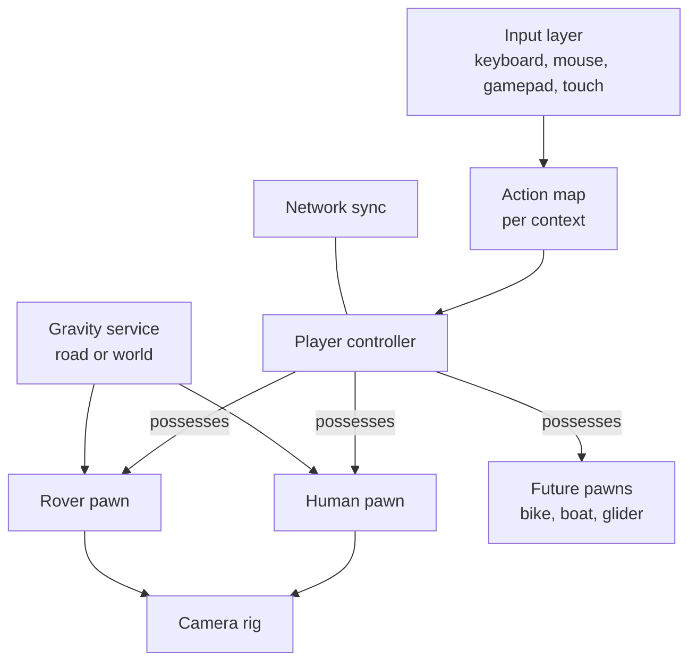

# 05 · Player Controllers: On Foot, Rover and Cameras

This chapter defines how the player moves: as a **human character** in first or third person, and in the **rover** on ribbon roads and in open areas. All controllers share one input layer, one gravity system and one camera rig, so switching between them is smooth.

## 1. The pawn system

- The **player controller** owns input and "possesses" exactly one **pawn** at a time.
- Each pawn declares its **action map** (on-foot actions, driving actions) and its **camera profiles**.
- Entering the rover = the human pawn plays the get-in animation, then the controller possesses the rover; the human is hidden or seated (visible in the cockpit and to other players).
- Every pawn runs on a **fixed simulation step (60 Hz)** separate from rendering, so movement is the same on every machine. This is needed for ghosts, replays and multiplayer ([09](09-multiplayer.md)).

## 2. The gravity service

Gravity is the soul of this game. One service answers "which way is down here?" for any position.

| Zone type | Down vector | Used for |
| --- | --- | --- |
| **World** | Straight down | Hubs, the ground, the sea |
| **Road** | Minus the road's up vector at the nearest spline point | Ribbon routes: walls, ceilings, loops |
| **Surface** | Minus the surface normal of a tagged mesh | Special pockets (a planet-like floating island, a walkable cylinder) |
| **Blend volume** | Smooth blend between two zones over 0.3–1.0 s | On-ramps, jumping off a road into open air |

Rules:
- A pawn **captures** road gravity when it is within 3 m of a road surface (on foot) or touching it (rover).
- When it leaves (jump, fall), it keeps the last road gravity for 0.6 s, then blends to world gravity. This makes hops on ceilings land back on the ceiling.
- The HUD **gravity compass** shows the current down direction relative to the camera with labels: DOWN IS DOWN · SIDEWAYS · UPSIDE DOWN.

## 3. Human character (on foot)

### 3.1 Look and body

- Stylised paper-doll human, 1.5–1.7 m, big head, strong silhouette ([03](03-art-direction-watercolor.md#6-characters-in-the-painted-style)).
- Fully customisable ([08](08-customization-and-creation.md)): body shape, skin tone, face, hair, clothes, hat, backpack, accessories.
- **Full-body awareness:** in first person you see your own arms, legs and body.

### 3.2 Moves

| Move | Details |
| --- | --- |
| Walk / jog / sprint | Walk 1.6 m/s, jog 4 m/s, sprint 7 m/s. Analogue stick gives any speed between. Sprint uses no stamina in cosy mode; optional stamina in challenge rules. |
| Jump | 1.2 m height; coyote time 0.12 s; jump buffer 0.15 s; variable height by holding. |
| Double hop | Unlocked item "paper wings": a small second jump with a flutter. |
| Crouch / sneak | For small spaces and sneaking up on cats for photos. |
| Climb | Only on marked handholds (painted yellow) and ladders; ledge grab and pull-up; mantle over waist-high walls automatically. |
| Slide | Slide down slopes and water chutes. |
| Swim | Simple surface swim in shallow water and fountains; deep sea = gentle "splash & respawn on shore". |
| Glide | Later unlock: paper glider from high points. |
| Sit / lean / lie down | On benches, walls, grass — context prompts. |
| Interact | Talk, pick up, pet, play instrument, open door, get in vehicle, take photo, wave, emote. |
| Emotes | Emote wheel (8 slots): wave, dance, clap, point, sit, laugh, bow, air guitar. |

### 3.3 Movement feel

| Parameter | Value (starting point) |
| --- | --- |
| Ground acceleration | 30 m/s² (snappy but not instant) |
| Ground deceleration | 40 m/s² |
| Air control | 35 % of ground |
| Turn rate (third person) | 720°/s, character faces movement direction |
| Max walkable slope | 45° relative to current gravity |
| Step height | 0.35 m (stairs work without ramps) |
| Landing | Small squash, dust puff; heavy landing above 6 m drop gives a roll |

Physics uses a **kinematic character controller** (capsule, sweep and slide, step-up, slope limit, moving-platform support) in the physics engine ([11](11-technical-architecture.md)). Its "up" is always the negative of the gravity service's down vector, so the same controller walks on floors, walls and ceilings.

### 3.4 Animation

- **Locomotion blend space:** idle → walk → jog → sprint, with lean into turns and start/stop clips.
- **Foot IK:** feet plant on stairs and slopes; hips drop on uneven ground.
- **Look-at IK:** head turns to nearby characters, cats and points of interest.
- **Hand IK:** hands on steering wheel, railings, ledges, instruments.
- **Layered upper body:** wave or hold a camera while walking.
- **Painted style:** character animation can run on twos (12 fps pose steps) as a style option, while movement stays smooth.

### 3.5 First-person view

- Camera at eye height (1.55 m), attached to the head bone with smoothing.
- FOV 70–110° slider (default 85).
- Head bob: 0–100 % slider (default 40 %), off in reduced motion.
- Body is visible; the camera hides the head mesh only.
- When gravity changes (walking onto a wall road), the view **rotates smoothly over 0.5 s** around the view direction; a "stable horizon" option rotates the world pieces in, not the camera, for motion-sensitive players.

### 3.6 Third-person view

- Orbit camera over the shoulder: distance 3.5 m (range 1.5–8 m), height 1.6 m, shoulder offset 0.4 m (swap left/right with a key).
- Mouse / right stick orbit; auto-recentre behind the character after 2 s of movement without camera input (can turn off).
- Camera collision identical to the driving camera (§5).
- Aim-free: this game has no shooting, so third person is for exploration and style.

## 4. Rover controller

The rover has **two driving models**: *ribbon* for spline roads (the core of the game) and *free* for open hubs. The switch happens at on-ramp arches and is invisible to the player.

### 4.1 Ribbon mode (road-relative arcade)

The car's state is: distance along the road `s`, sideways offset `x`, speed `v`, height above the road `h` and vertical speed. Position and orientation are read from the road lookup table. This is cheap, stable in loops and tiny to send over the network.

| Rule | Detail |
| --- | --- |
| Throttle / brake | Accelerate to top speed (≈ 190 km/h); brake fast; slow reverse. |
| Cruise floor | Speed never drops below 68 km/h on steep or inverted roads (like the reference). Toggle "free throttle" in settings for full control. |
| Steer | Changes sideways speed; strong at low speed, softer at high speed. Kerbs push back with a bump. |
| Drift | Hold brake + steer above 90 km/h: tail slides out visually, tighter turn, fills boost. "SKID!" pop text. |
| Hop | Adds vertical speed along road-up; lands back on the road. Air time scores ("AIR +22"). Clean landing = small boost. |
| Air control | Small pitch/roll tricks in the air (flips on long jumps), purely for style points. |
| Boost | Uses a boost meter filled by notes, drifts and air time; FOV +8°, speed lines, exhaust puffs. |
| Off-road | Only at deliberate gaps. Off-road > 1.2 s = respawn with paper-border fade. |

### 4.2 Free mode (open areas)

- Raycast-suspension vehicle in the physics engine: 4 wheel rays, spring and damper per wheel, tyre grip curve, anti-roll.
- Tuned to feel **the same** as ribbon mode: same top speed, similar steering response, same hop and boost.
- World gravity applies; the rover can bump into props, push crates and park anywhere.
- At an on-ramp arch the car is snapped onto the spline over 0.3 s (position and velocity blended), then ribbon mode takes over. Leaving a route end does the reverse.

### 4.3 Rover parts and animation

- Body (tilt, bounce, squash on landing), 4 wheels (spin, steer, suspension travel), gramophone horn on the roof (pulses with the beat), antenna (spring), brake and head lights, exhaust puffs, the driver visible in the seat.
- Getting in and out: 1.2 s animation; can be cancelled into running. Honk button plays a note in the current key.

### 4.4 Vehicle feel parameters (per car model)

| Parameter | Rover (default) | Range for other cars |
| --- | --- | --- |
| Top speed | 190 km/h | 150–230 |
| 0–100 km/h | 3.2 s | 2.5–5 |
| Grip | 1.0 | 0.7–1.3 |
| Steering at speed | 0.55 | 0.4–0.8 |
| Hop height | 2.2 m | 1.5–3.5 |
| Boost capacity | 4 s | 3–6 |
| Weight feel (landing bounce) | medium | light–heavy |

Car models differ in feel but are balanced so none is strictly better (see [08](08-customization-and-creation.md#2-garage-rover-and-other-vehicles)).

## 5. Camera system

One camera rig serves every pawn. It follows the **pawn's local up**, not the world's, so loops and ceilings feel natural.

### 5.1 Camera modes

| Mode | Pawn | Distance / height | Notes |
| --- | --- | --- | --- |
| Chase (default) | Rover | 7 m behind, 3 m up | Looks 12–25 m ahead along the road (more at high speed) |
| Low | Rover | 4 m behind, 1.2 m up | Speed feel |
| Drone | Rover | 14 m behind, 10 m up, looks down | See note lines ahead |
| Cinema | Rover | Close, low, slow lag, slight Dutch angle | Clips and trailers |
| Cockpit (first person) | Rover | Driver's eye, dashboard and hands visible | Wipers in rain |
| Third person | Human | 3.5 m orbit, shoulder offset | §3.6 |
| First person | Human | Eye height | §3.5 |
| Photo | Any | Free fly, pauses solo play | [08](08-customization-and-creation.md#5-photo-mode) |
| Spectate | Any | Follow another player, or free | Multiplayer |
| Title / attract | — | Authored rails through the world | Like the reference title screen |

`C` cycles modes available to the current pawn. Scroll zooms distance; `[` `]` change FOV.

### 5.2 Camera rules (fixing reference bugs P1, P2)

1. **Smooth follow:** critically damped springs on position and look target. No hard snaps except respawn and mode change (0.25 s blend).
2. **Up-vector blend:** turn camera up toward pawn up at 2–4 per second, faster in loops so the horizon never lags. "Stable horizon" option for motion-sensitive players.
3. **Collision:** each frame sphere-cast (radius 0.3 m) from the pawn to the ideal camera position against a *camera collision layer* (walls, roofs, canopies, arches). If blocked, move the camera in to the hit point; ease back out over 0.4 s.
4. **Fade, don't fill:** any mesh tagged *camera blocker* within 3 m of the lens fades to 30 % with a dithered paper pattern. The screen can never be filled by one object.
5. **Water clamp:** the camera always stays at least 1 m above the sea surface. Falling pawns trigger the respawn fade before the camera reaches the water.
6. **Look-ahead on routes:** the look target leads along the spline, not straight ahead, so the camera "sees round" curves and up walls.
7. **District intros:** pull out 20 % for 2 s while the title shows.
8. **Speed feel:** FOV + 0–8° with speed, + 8° when boosting (slider; off in reduced motion).
9. **Shake:** only on big landings and thunder, tiny amplitude, slider 0–100 %.

## 6. Controls — full default bindings

All bindings are rebindable per device. Hold-vs-toggle for sprint, crouch, drift and boost are options.

### On foot

| Action | Keyboard + mouse | Gamepad | Touch |
| --- | --- | --- | --- |
| Move | W A S D | Left stick | Left virtual stick |
| Look | Mouse | Right stick | Drag right half |
| Sprint | Shift | L3 / LB | Double-tap stick |
| Jump | Space | A / Cross | Button |
| Crouch | Ctrl (hold or toggle) | B / Circle | Button |
| Interact | E | X / Square | Context button |
| Get in / out of vehicle | F | Y / Triangle | Context button |
| Emote wheel | G (hold) | D-pad up (hold) | Button |
| Switch 1st / 3rd person (camera mode) | V or C | R3 | Button |
| Swap shoulder | Q | D-pad left | — |
| Photo mode | P | Select | Button |
| Map | M | View / Touchpad | Button |

### Driving

| Action | Keyboard | Gamepad | Touch |
| --- | --- | --- | --- |
| Throttle / brake | W / S | RT / LT | Right / left pedal zones |
| Steer | A / D | Left stick | Tilt or on-screen stick |
| Hop | Space | A / Cross | Button |
| Boost | Shift | X / Square | Button |
| Drift | Hold S + steer, or Ctrl | B / Circle | Button |
| Honk (plays a note) | H | L3 | Button |
| Camera mode | C | Y / Triangle | Button |
| Zoom / FOV | Scroll / [ ] | Right stick up/down | Pinch |
| Look around | Mouse drag | Right stick | Drag |
| Get out | F | Hold Y | Button |
| Respawn to checkpoint | R (hold) | Hold Back | Button |

### Global

| Action | Keyboard | Gamepad |
| --- | --- | --- |
| Radio on/off, next song, band | T, N, B | D-pad down / right / left |
| Time of day presets | 1–8 | LB/RB + D-pad |
| Weather cycle | 9 | — |
| Studio panel | F2 | — |
| Pause / menu | Esc | Start |
| Chat / voice push-to-talk | Enter / ` | D-pad (quick chat wheel) |
| Screenshot (instant) | F12 | Share |

Input rules: gamepad dead zones (inner 0.12, outer 0.95, slider), response curves (linear / exponential / custom), invert Y per view, mouse sensitivity per view, steering assist and auto-throttle options for accessibility.
