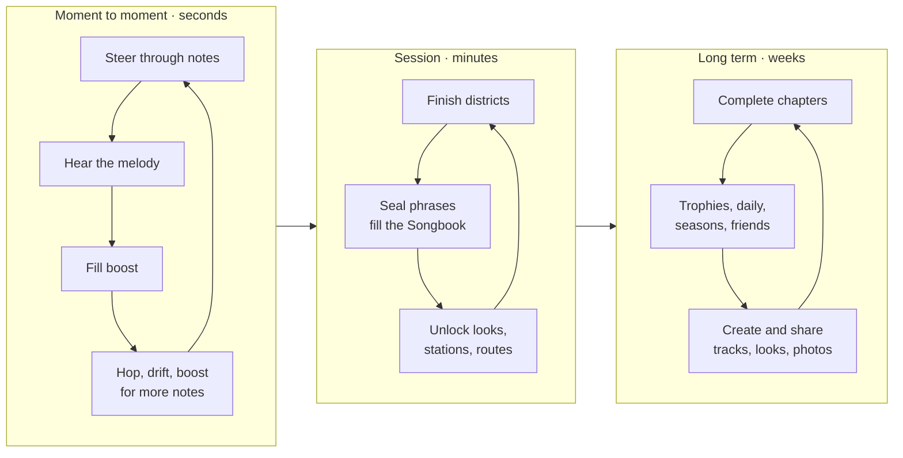

# 06 · Gameplay Systems

## 1. Core loops

## 2. Notes and the Songbook

Notes are the main pickup and the main reward: every note plays the next step of the district melody.

| Rule | Detail |
| --- | --- |
| Melody data | Each district has a melody of 32–64 steps (pitch, length, colour). |
| Placement | Notes are placed from the melody: pitch maps to height or sideways offset, so the note line **draws the melody's shape** and also marks a good driving line. |
| Playback | A collected note plays its pitch on a music-box / celesta sound, **quantised to the next 1/8 beat** of the backing track. It always sounds musical. |
| Colour = pitch | C yellow, D pink, E blue, F orange, G green, A purple, B teal. Same across the game. Colour-blind mode adds shapes inside each note. |
| Phrase | 8 consecutive melody steps. Collect all 8 → "SEALED" chime, a note burst, the phrase card fills in the Songbook. |
| Missed notes | Leave a gap; the backing track keeps playing so nothing sounds broken. |
| Pickup radius | 1.5 m (rover), 1.0 m (on foot); magnet widens it. |
| On foot | Notes also float in hubs and pockets; collecting on foot plays them the same way (jumping puzzles become melodies). |

**Songbook** (bottom-centre strip): one small staff card per phrase; dots appear as notes are collected; sealed phrases get a colour wash. Counter "notes 14/280 · phrases 3/15".

Songbook features:
- **Play my song:** plays back exactly the notes you caught, in order, over the backing track. Share as a link or a short audio clip.
- **New songbook:** reseeds melodies procedurally (same scale and rhythm rules, new tune) for replay.
- **Daily songbook:** one seeded songbook per day, the same for everyone, with its own leaderboard.
- **Duet mode:** in co-op, notes are split into two colours, one per player; together you play the full song.

## 3. Pickups and "tonics" (buff with a drawback)

The reference pairs every power-up with a cost ("NOTE MAGNET · NO BOOST", "HIGH JUMPS · NO BRAKES"). This is a strong idea: choices, not just rewards. We keep it and make it a system.

### Instant pickups

| Pickup | Look | Effect |
| --- | --- | --- |
| Note | Coloured quaver | Melody step, +1 boost, counts toward phrase |
| Bolt ("Thunder") | Lightning | Fills boost meter |
| Speed pad | Glowing strip | Instant speed burst |
| Star stamp | Paper star | Collectible (hidden, 5 per district) |
| Postcard | Envelope | Story snippet, unlocks a hub scene |
| Sticker | Round sticker | Cosmetic unlock |

### Tonics (timed, with a drawback; 8–12 s)

| Tonic | Look | Buff | Drawback |
| --- | --- | --- | --- |
| Magnet | Green horseshoe | Pulls notes within 8 m | No boost while active |
| Feather | Paper feather | High, floaty hops | No brakes |
| Full Tank | Red jerry can | Boost meter full and unlimited | No refill afterwards for 10 s |
| Fizzy Ink | Pink bottle | +20 % top speed | Wobbly steering |
| Focus Tea | Blue cup | Slow motion 0.7× (bullet time) | Notes worth nothing in combo |
| Rubber Tyres | Yellow tyre | Bounce off walls with a boost | Can't drift |
| Echo | Seashell | Every note plays twice (harmony) | Camera locked to drone |
| Ghost Paint | White brush | Drive through crates and balloons | Half boost gain |

- Up to **2 tonics** active at once; the pills above the Songbook show buff ▾ drawback with a countdown ring.
- On foot, tonics apply their on-foot version (Feather = high jumps; Magnet = pull notes; Focus Tea = slow time for platforming).
- In races, tonics come from pickup boxes and are the main strategic layer.

## 4. Scoring and style

| Action | Score |
| --- | --- |
| Note | 10 × combo multiplier |
| Phrase sealed | 200 |
| Phrase sealed in the air | 400 ("AIR 1.1 s · SEALED") |
| Air time | 10 per 0.1 s |
| Clean landing | 50 |
| Drift | 5 per 0.1 s |
| Near miss (NPC car, crate) | 25 |
| Flip / roll trick | 150 |

Combo: each note within 1 s of the previous raises the multiplier (×1 → ×8). Missing a note drops it one step. Score is optional to watch; the cosy HUD hides it.

## 5. Time trial

- Timer top-centre: district time, lap time, best, personal best (PB), delta.
- **Split card** at each district end: "✓ Biscuit Row · 0:05.70 · −0.20 vs best" (green faster, red slower).
- **Ghosts:** your best lap, a friend's ghost, the leaderboard top 10, a developer ghost. Up to 4 at once, translucent painted outlines.
- **Rules:** tonics off in ranked trials (or a separate "tonic" board); fixed weather and time per board.
- Leaderboards per district, per chapter lap, per daily; friends / region / global.

## 6. Game rules and modifiers (everything controllable)

Players can change the rules. Modifiers are shown in the status chip and mark scores as "modded" (separate boards).

| Category | Options |
| --- | --- |
| Speed | Cruise floor on/off, top speed 50–150 %, game speed 50–125 % |
| Assists | Steering assist, auto-throttle, auto-hop at ramps, note guide line |
| Challenge | No boost, no brakes, mirrored route, one-hit ink (a crate costs 2 s), night-only, rain-only |
| Physics | Gravity strength 50–200 %, hop height, grip |
| Fun | Big-head mode, tiny cars, confetti trails, every note a drum, "paint trail" (the road behind you is painted with your colour) |
| On foot | Stamina on/off, fall damage off (always), double jump on/off |

Presets: **Cosy** (default), **Classic**, **Racer**, **Chaos**, **Custom**.

## 7. Progression

- **No levels or XP grind.** Progress is what you collect: phrases, postcards, stars, stickers, trophies.
- **Unlock gates:** Chapter 2 opens at 20 sealed phrases; Chapter 3 at 50; Chapter 4 at 90. Hubs open with their chapter.
- **Unlocks (all cosmetic or new toys):** car bodies, paints, roof loads, horn sounds, character clothes, emotes, radio stations, vibe presets, photo frames, tonic types for free play.
- **Trophies (100+):** sticker album page; examples: "Seal every phrase in Citrus Coil", "2 s air time", "Drive a whole chapter at night in the rain", "Pet 20 cats", "Play a duet with a friend", "Walk the ceiling of Topsy Terrace".
- **Seasons (live service):** every 8–10 weeks: a new district or pocket, a radio station, a cosmetic set and a free season sticker track. No paid power.

## 8. On-foot activities (hubs and pockets)

| Activity | Description |
| --- | --- |
| Note platforming | Short jumping routes on rooftops and walls that play a melody when completed |
| Cat album | Find and pet all cats; each has a name and a doodle |
| Instruments | Pianos, drums, xylophones in hubs; play them freely or with friends; rhythm prompts optional |
| Painter's easels | Stand at an easel to take a painted "postcard" of the view (photo mode preset) |
| Postcards | Deliver postcards to characters on foot → story scenes |
| Hidden stamps | 5 per district, 20 per hub |
| Cafés | Sit, order a drink (a tonic for your next run), watch the world |
| Dress-up | Wardrobe shop, try-on mirror |
| Garage | Walk into the garage to customise the rover |
| Emote spots | Dance floors and stages where emotes sync to the radio beat |

## 9. Story (light)

A quiet story told through postcards: the Postie delivers letters from a painter who drew this town and then forgot how the roads went. Each chapter's letters explain one district's memory. The final chapter lets the player paint a new road home. No cutscenes over 30 s; all skippable; all told with painted panels in the world.
