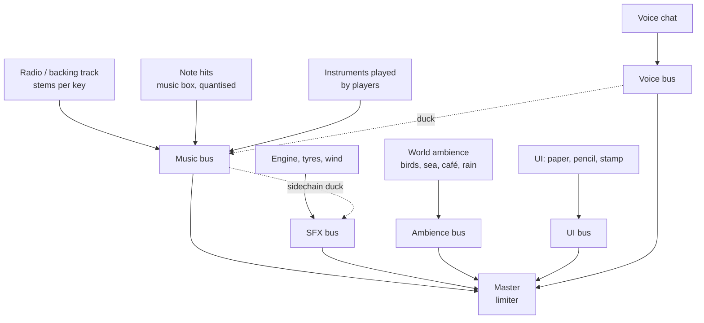

# 07 · Audio and Music

Music is the reward loop. The player's path through the notes is the song, the radio is the backing band, and the world adds soft sounds under it. Everything is built on the Web Audio API with a small scheduling layer (a library such as Tone.js is fine).

## 1. Audio layers

| Layer | Source | Notes |
| --- | --- | --- |
| Radio / backing | Streamed loops, 90–110 bpm, stems (drums, bass, keys, pad) | Written in the district's key and tempo |
| Note hits | Pitched music-box, celesta, marimba, glockenspiel samples | Quantised; slight random velocity; one instrument per station |
| Instruments | Sampled piano, drums, xylophone, guitar | For hub instruments and jam sessions |
| Engine | Synth oscillator + filtered noise | Pitch follows speed; boost adds a whistle |
| Tyres | Granular loops per surface | Paving, wood, glass, water, paper |
| Footsteps | 6 surfaces × 8 variations | Human character; pitch shifted by shoe type |
| Wind | Filtered noise | Louder in sky districts and at speed |
| Ambience | Per-district beds | Birds, sea, café chatter, market, rain, night insects |
| UI | Paper rustle, pencil tick, rubber stamp | Every button |
| Voice | WebRTC voice chat | Optional ([09](09-multiplayer.md)) |

## 2. Adaptive music

- **Key and tempo follow the district.** At each district border the radio crossfades to the next stem set over 1 bar, timed to the beat.
- **Intensity follows play:** stems add in with speed and combo (pad → keys → bass → drums). Stopping or walking strips back to pad and keys.
- **Time of day filter:** darker, slower pads at night; brighter at noon.
- **Vibe filter:** each vibe preset applies an effect chain (tape warble, reverb, bitcrush) — see [03](03-art-direction-watercolor.md#4-vibe-presets-new-look).
- **Tonics:** Focus Tea slows and low-passes the music; Fizzy Ink adds a wobble; Echo adds harmony.
- **Hubs:** each hub has diegetic music (café radio, street musician, stage) that gets louder as you approach, and the player's own radio when in the car.

## 3. Quantisation (why it always sounds good)

1. A note is collected at an arbitrary time.
2. The scheduler finds the next 1/8 beat of the backing track (at 100 bpm that is at most 0.3 s later; usually much less).
3. The note plays on that beat. If two notes land on the same slot, the second moves to the next 1/16.
4. The note's pitch is always in the current key, so any order still harmonises.

Latency rule: the visual burst plays **instantly**, only the sound is quantised. Players feel responsive and hear music.

## 4. Radio

| Feature | Detail |
| --- | --- |
| Stations | 8 at launch, each with a name, frequency, host voice lines and 6–10 tracks. Examples: *88.3 Paper Kite FM* (lofi), *92.1 Harbour Hum* (acoustic), *97.7 Midnight Ink* (ambient), *101.5 Paint Pop* (upbeat), *104.7 Slow Tide* (sleepy), *107.9 Brass Band Radio* (swing). |
| Controls | OFF · NEXT · BAND (switch station); dial animation between stations with a static "paper crackle" |
| Player stations | Players can make a playlist of their "Play my song" recordings and friends' songs as a personal station |
| In multiplayer | The lobby host's station can be shared ("listen together") or each player keeps their own |
| Gramophone | The horn on the rover pulses with the beat; small notes drift out of it when the radio is on |

Licensing: all music is commissioned and owned (buy-out), so players can stream and share clips without copyright strikes. Provide a "streamer safe" flag anyway.

## 5. Spatial audio

- Web Audio panner nodes with HRTF for nearby players' cars, NPC chatter and hub instruments.
- Distance models tuned per category (NPC voices fall off at 15 m; instruments at 40 m; cars at 60 m).
- Occlusion approximation: a low-pass when a building sits between the listener and the source (one ray per source per 200 ms).
- Reverb zones: tunnels, under bridges, interiors, the loop.

## 6. Mixing rules

- Music bus ducks SFX by 3 dB when a phrase seals so the chime is clear.
- Voice chat ducks music by 6 dB while someone speaks.
- Master limiter prevents clipping.
- Default levels: master 80 %, music 70 %, SFX 70 %, ambience 60 %, UI 50 %, voice 80 %. All sliders in settings plus a "music-box notes" slider as in the reference Studio panel.
- Audio starts only after the first user click or key press (browser autoplay rules). The START button handles it.

## 7. Audio assets and budgets

- Format: Opus/OGG with AAC fallback; loops cut on bar lines; stems per key.
- First-load audio budget: 3 MB (one station's first track + note samples + core SFX). Everything else streams.
- Sample rate 48 kHz; mono for SFX, stereo for music.
- Max simultaneous voices: 48 (desktop), 24 (mobile), with priority stealing.
