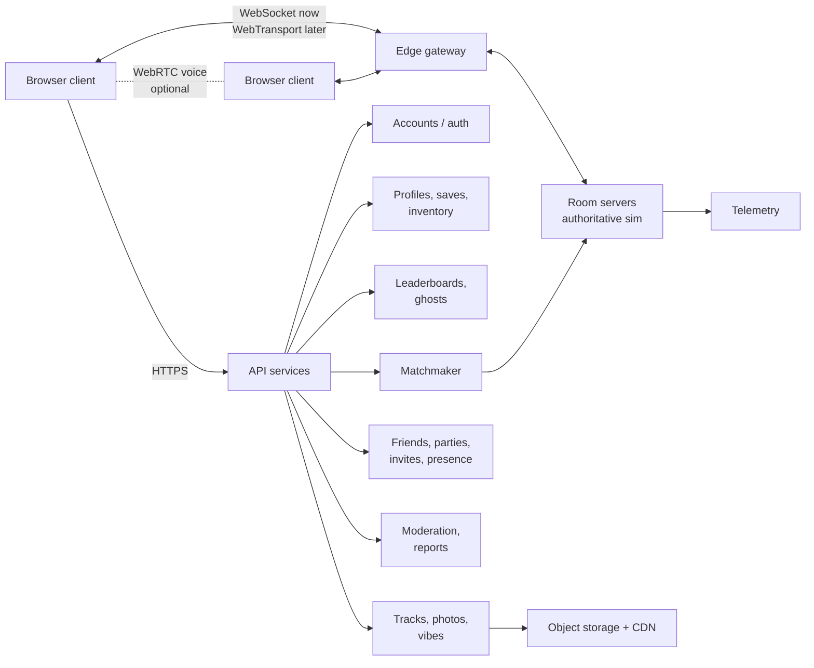

# 09 · Multiplayer and Online Services

Multiplayer must feel as gentle as the single-player game: click a friend's link, appear next to them in the same painted town within 15 seconds, and drive or walk together. Competitive racing is a second layer on the same technology.

## 1. Multiplayer modes

| Mode | Players | Server type | Notes |
| --- | --- | --- | --- |
| **Hub (shared world)** | up to 32 per instance | Authoritative room server | Walk, drive, emote, play instruments, photos. Auto-split into instances; friends always land in the same one. |
| **Co-op Story** | 2–4 | Room server | Drive a chapter together; notes are shared or split (duet). Anyone can join mid-route. |
| **Cruise / Photo Walk** | 2–8 | Room server | No timer; leader sets route, time and weather; end-of-walk photo vote. |
| **Live Race** | 2–8 | Room server (strict) | Casual and ranked; tonic boxes on or off; rolling start. |
| **Duet** | 2 | Room server | Two melody halves; score is a shared "harmony" rating. |
| **Ghost Race** | 1 + up to 4 ghosts | No live server (async) | Ghost files downloaded from the leaderboard service. |
| **Daily** | Async | Leaderboard service | Same seed for everyone. |
| **Jam session** | 2–8 | Room server | Hub instruments played together, quantised to a shared beat clock. |

## 2. Architecture

- **Room servers** run the same game simulation code as the client (shared TypeScript sim module, fixed 60 Hz step, no rendering). They are authoritative for positions, pickups, notes, scores and race results.
- **Transport:** WebSocket (binary messages) at launch because it works everywhere; add **WebTransport** (unreliable datagrams, lower latency) where supported. Voice uses **WebRTC** peer-to-peer in small groups or through an SFU for larger rooms.
- **API services** are stateless HTTP services with a relational database for accounts, progress and leaderboards, a cache for presence and sessions, and object storage + CDN for ghosts, tracks and photos.
- **Regions:** start with 3 (EU, US-East, Asia-Pacific); matchmaking picks the lowest-ping region for the party.

## 3. Netcode

### 3.1 Tick rates

| Item | Rate |
| --- | --- |
| Simulation (server and client) | 60 Hz fixed |
| Client → server input | 30 Hz (inputs for 2 ticks per packet, redundant last 3 packets) |
| Server → client snapshot | 20 Hz hubs, 30 Hz races |
| Interpolation delay for remote players | 100 ms (adaptive 60–150 ms) |

### 3.2 Own pawn: prediction and reconciliation

- The client simulates its own pawn immediately from local input (no waiting for the server).
- The server sends back the authoritative state with the last processed input number.
- The client rewinds to that state and replays unacknowledged inputs. Differences are smoothed over 100 ms visually so there are no pops.

### 3.3 Remote pawns: interpolation

- Remote players are drawn 100 ms in the past, interpolated between snapshots. Short gaps use extrapolation up to 150 ms.
- **Ribbon cars are cheap to sync:** state is `s`, `x`, `h`, `v`, vertical speed, steer, flags (boost, drift, hop). About 20 bytes per car per snapshot after quantisation and delta compression. 8 cars at 30 Hz ≈ 5 KB/s per player.
- **Free cars and humans:** position (quantised to 1 cm within the room cell), rotation (smallest-three quaternion), velocity, animation state id and blend value. About 24–32 bytes each.
- **Interest management:** in hubs, send full-rate data only for the 16 nearest players; others at 5 Hz; players > 150 m away are dropped from the snapshot.

### 3.4 Shared objects

| Object | Authority | Sync |
| --- | --- | --- |
| Notes (co-op) | Server | Collected-by events; shared or per-player depending on mode |
| Notes (race) | Per-player (each racer has own notes) | Local, validated by server |
| Tonic boxes | Server | Respawn timers |
| Crates, balloons | Client-visual only in hubs; server in races | Events |
| Time of day / weather | Room owner or server | One value + blend start time |
| Beat clock (music) | Server clock | All clients sync the radio beat to server time so jams and duets line up |

### 3.5 Collisions between players

- **Hubs and cruise:** cars and people are *soft ghosts* to each other by default (no ramming, no griefing); a gentle push-apart force when overlapping.
- **Races:** car-to-car bumping on (server-resolved), with a minimum-damage rule: bumps change speed a little, never flip or knock off the road.

## 4. Sessions, parties and joining

- **Party:** up to 8 friends move together between hub, story and race.
- **Invite by link:** every session has a short URL. Opening it loads the game straight into that session (guest play allowed for friends' links).
- **Presence:** friends list shows "In Harbour Town", "Racing Citrus Coil", "Offline".
- **Join in progress:** allowed in hubs, co-op and cruise; races join at the next start.
- **Host migration** is not needed (servers are authoritative).
- **Reconnect:** if the connection drops, the client keeps simulating locally for up to 10 s, then rejoins the same room and resyncs.

## 5. Matchmaking (races)

- Casual: party size + region + ping < 120 ms; fill with AI "painter" racers after 20 s wait if the player chooses.
- Ranked: skill rating (Glicko-2 style) per season; 8-player lobbies; placement races; ranks named after paper sizes and pencils (Sketch, HB, 2B, 4B, Ink, Master).
- Cross-play: every platform plays together (desktop, mobile, controller). Touch players can choose to match only with touch players in ranked.

## 6. Leaderboards and ghosts

- **Every run records its inputs** (compact: one byte per input axis per tick, run-length encoded) plus the seed and version. That file *is* the ghost.
- **Validation:** for leaderboard submissions, the server re-simulates the input file with the deterministic sim. If the result doesn't match the claimed time, the run is rejected. This is the main anti-cheat for time trials.
- Boards: per district, per chapter lap, daily, weekly, per vehicle body, modded vs clean.
- Ghost download: top 10, friends, "near your time" (ghosts just faster than you, the best motivation).

## 7. Anti-cheat

| Threat | Mitigation |
| --- | --- |
| Speed or teleport hacks in live play | Server-authoritative simulation; client state is only a prediction |
| Fake leaderboard times | Deterministic re-simulation of input files (§6) |
| Memory editing unlocks | Unlocks granted and stored server-side |
| Bots in ranked | Rate limits, behaviour heuristics, report tool |
| Packet flooding | Per-connection rate limits at the gateway |

The sim must be deterministic: fixed step, no `Date.now()` in the sim, seeded random, and a fixed-precision approach for critical maths (or careful float ordering and tests that compare runs across browsers).

## 8. Safety and moderation

This is a cosy game with a young audience. Safety is a launch requirement.

- **Default off:** text and voice chat off for new accounts and for under-16 accounts; quick-chat wheel (pre-written phrases) always available.
- **Text chat:** profanity filter with multiple languages, rate limits, link blocking.
- **Voice:** push-to-talk default; per-player mute; auto-mute on reports until reviewed.
- **Blocking:** blocked players are invisible to you and can't join you.
- **Reporting:** one-click report with the last 60 s of chat and position data attached.
- **UGC:** track titles, descriptions and photos pass automated checks (text filter, image classifier) before public listing; community reports; human review queue.
- **Names:** display names filtered; no personal info shown.
- **Parental controls:** PIN-locked settings for chat, friend requests and UGC visibility.
- **Compliance:** privacy policy, GDPR/CCPA data export and delete, COPPA-appropriate handling for under-13 accounts.

## 9. Accounts

- **Guest first:** play without an account; progress stored locally.
- **Sign-in options:** email magic link and common social logins.
- **Account merge:** guest progress uploads on first sign-in.
- **Cross-device:** same account on laptop and phone; cloud saves.

## 10. Scaling and cost (planning numbers)

| Item | Estimate |
| --- | --- |
| Room server CPU | One 2-vCPU instance hosts ~40 hub rooms or ~60 race rooms (the ribbon sim is light) |
| Bandwidth per hub player | 6–12 KB/s down, 2 KB/s up |
| Bandwidth per racer | 5–8 KB/s down |
| Launch target | 5,000 concurrent players → about 20–30 room instances across 3 regions, autoscaled |
| Static assets | Served from CDN; first load < 15 MB, full game ≈ 250–400 MB streamed on demand |

Load-test with headless bot clients (the same sim with scripted inputs) before every major launch.

## 11. Multiplayer roll-out order

1. **Ghost races and async leaderboards** (no live servers; proves determinism).
2. **Hub with friends** (4 players, walking and free-driving, emotes).
3. **Co-op story and cruise** (ribbon cars in sync, shared time/weather).
4. **Live races** (casual, then ranked).
5. **Voice, jam sessions, duets, UGC sharing.**
