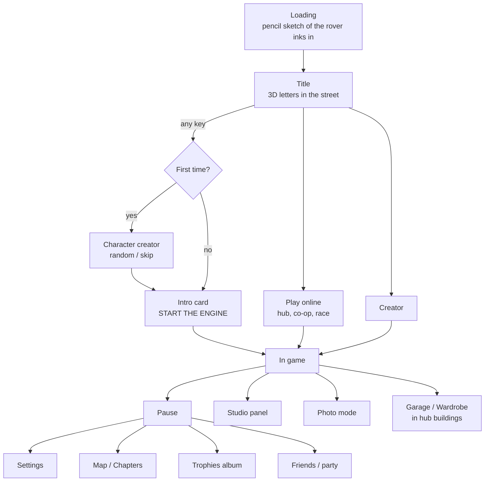

# 10 · UI, UX and HUD

All UI looks like **paper cards** on the sketchbook page: cream fill, thin ink border, a slight drop shadow, a hand-lettered display font for titles and small uppercase labels. The UI is HTML/CSS layered over the canvas (easy to style, accessible, localisable). The centre of the screen always stays clear for the road.

## 1. Screen flow

## 2. In-game HUD

### Driving HUD

| Position | Element | Contents |
| --- | --- | --- |
| Top-left | Logo + clock | Logo, clock with band name ("09:30 MORNING") |
| Top-left bar | Time and weather pills | Dawn … Deep night, Auto, weather; collapsible to one button |
| Top-left chip | Status | "♪ 14/280 · MORNING · sketchbook" (notes · time · vibe) |
| Top-centre | Timer (trial/race) | District time, lap, best, PB, delta; race position "3rd / 8" |
| Top-right | Chapter / map buttons | Chapters, map, party members (avatars with voice indicator) |
| Centre | District title card | Small subtitle, big hand-lettered name, poem line, on a paper plate; fades in 0.4 s, holds 2 s, fades out |
| Above centre-bottom | Tonic pills | Buff ▾ drawback, countdown ring |
| Centre-bottom | Songbook strip | Phrase cards; current phrase outlined |
| Centre-bottom (trial) | Split card | "✓ Biscuit Row 0:05.70 −0.20" |
| Bottom-left | Radio card | Dial, station, track n/N, progress, OFF / NEXT / BAND |
| Bottom-right | Speed card | Gravity compass, speed, boost bar, district name, quick buttons (camera, rules, trophies, studio) |
| Edges | Border and speed lines | Paper frame; speed lines at high speed |

### On-foot HUD

Speed card becomes a **walk card**: gravity compass, current area name, stamina ring (only if stamina rules are on), and the interaction prompt appears near the target in the world ("E · Pet Biscuit the cat"). Songbook shrinks to one line unless notes are nearby.

### Multiplayer additions

- Name tags on paper labels above players (distance-faded; hide option).
- Party list top-right with mic icons.
- Race: position, lap, gap to next player, mini ribbon map (the route drawn as a line with player dots).
- Quick-chat wheel and chat panel (collapsed by default).

### HUD rules (fixes reference P3 and P6)

- **Readability:** every world-space text gets a paper plate or thick ink outline; pop texts ("AIR +22") float near the car, never over the road ahead.
- **Compact mode:** HUD cards collapse to icons after 5 s of no change; expand on hover or when values change.
- **HUD scale** 60–150 % and per-element on/off.
- **Safe area:** respects phone notches and TV overscan.
- **Photo-clean:** one key hides the whole HUD.

## 3. Menus

| Screen | Content |
| --- | --- |
| **Loading** | A pencil drawing of the rover inks and colours itself in as progress; tips on paper scraps |
| **Title** | Real 3D title letters in the street with a boombox; banner "Drive the song"; `SPACE · DRIVE`; pill row: radio, daily, online, trophies, studio, new look, controls |
| **Intro card** | Pitch, "Start with the radio on" checkbox, START THE ENGINE, key legend for the detected device |
| **Pause** | Resume, Restart district, Respawn, Map, Settings, Controls, Invite friends, Quit to title |
| **Map / Chapters** | A folded paper map of the archipelago; routes as ribbons; per district best time, phrases, stars; fast-travel to hubs and unlocked districts |
| **Trophies** | Sticker album; locked stickers are pencil outlines with a hint |
| **Garage** | 3D rover on a turntable in a painted workshop; categories as tabs; before/after toggle |
| **Wardrobe** | Character on a stage with a mirror; categories as drawers |
| **Studio** | Right slide-in panel; sliders; live FPS |
| **Friends / Party** | Friends list, invites, party, recent players, block list |
| **Creator** | Toolbar left, properties right, timeline/melody bottom |
| **Settings** | Tabs from [08 §4](08-customization-and-creation.md#4-settings-complete-list) |

## 4. Input and navigation

- Every menu works with mouse, keyboard only, gamepad only and touch.
- Gamepad: focus ring drawn as a pencil circle; LB/RB switch tabs; A confirm; B back.
- Keyboard: Tab order, arrow keys, Enter, Esc.
- Button prompts change to the last-used device automatically (keyboard glyphs ↔ gamepad glyphs ↔ touch).

## 5. Touch / mobile layout

- Left: steer stick (or tilt); right: throttle and brake pedal zones; buttons for hop and boost near the right thumb.
- On foot: left move stick, right drag to look, jump and interact buttons.
- Layout editor: drag and resize every button; save per device.
- Auto-throttle on by default on touch.
- HUD in compact mode by default on screens below 900 px height.

## 6. Feedback and "juice" in the UI

- Every button: paper rustle sound, 60 ms press squash, pencil scribble hover underline.
- Numbers roll like an odometer.
- Split times stamp in with a rubber-stamp animation and sound.
- Phrase sealed: the Songbook card gets a watercolour wash that spreads over 0.5 s.
- New trophy: a sticker peels onto the screen corner.

## 7. Localisation

- Launch languages: English, Japanese, Korean, Simplified Chinese, Spanish, Portuguese (BR), French, German.
- All strings in data files; no text baked into textures (district titles are rendered from font + data so they localise).
- Hand-lettered fonts chosen with CJK-capable companions.
- Text expansion allowance 35 % in all layouts.

## 8. Onboarding (first 3 minutes)

| Time | Teach | How |
| --- | --- | --- |
| 0:00 | Throttle and steer | Painted words on the road: "Hold W to roll" → "Steer through the notes" |
| 0:30 | Notes make music | First phrase is easy; seal chime + Songbook highlight |
| 1:00 | Hop | Ramp panel with "Space to hop" painted before it |
| 1:30 | Road gravity | First wall climb; gravity compass pulses once |
| 2:00 | Boost | Boost bar fills; "Shift to boost" appears once |
| 3:00 | Hub and getting out | Route ends in Harbour Town; prompt "F to get out and look around" |

Hints never repeat once done; all can be replayed from Settings → Controls.
