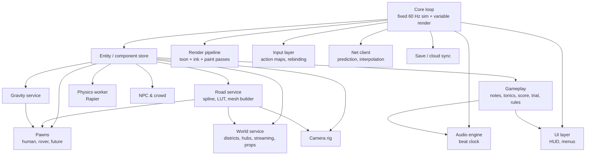
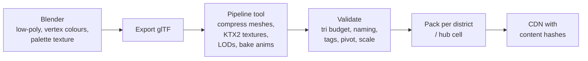

# 11 · Technical Architecture

This chapter describes how the game is put together: the stack, the modules, the frame loop, performance budgets, the asset pipeline and how we test and ship. No code — decisions and rules.

## 1. Stack

| Layer | Choice | Why |
| --- | --- | --- |
| Language | TypeScript (strict) | One language for client, server sim and tools |
| Build | Vite | Fast dev server, code splitting, asset hashing |
| Rendering | Three.js — WebGL2 renderer at launch, WebGPU renderer when stable on target browsers | Large community, both back-ends, good glTF support |
| Post-processing | Custom pass chain (or the `postprocessing` library as a start) | We need full control over the ink/paint passes |
| Physics | Rapier (WASM) for on-foot character, free-drive vehicle, props | Fast, deterministic mode available, runs in a worker |
| Ribbon physics | Custom road-relative sim (no physics engine) | Stable in loops; tiny network state |
| Audio | Web Audio API + small scheduling layer (Tone.js acceptable) | Beat-quantised notes |
| UI | HTML/CSS with a light component framework (Svelte, Solid or Preact) | Accessible, localisable, fast |
| Networking | WebSocket (binary) now, WebTransport later; WebRTC for voice | Browser support |
| Server | Node.js or Bun room servers running the shared sim; HTTP API services | Share the sim code with the client |
| Data | PostgreSQL (accounts, progress, boards), Redis (presence, sessions), object storage + CDN (ghosts, tracks, photos) | Standard, scalable |
| Dev tools | lil-gui / Tweakpane for internal tuning, a custom in-browser level editor | Tune by eye |

## 2. Module map

Rules:
- **Simulation and presentation are split.** The sim (road, gravity, pawns, gameplay, physics) never touches Three.js, the DOM or audio. The same sim module runs in the browser, in a headless server, and in test runners.
- **Fixed step:** the sim runs at 60 Hz with an accumulator; rendering interpolates between the last two sim states. Slow frames run up to 4 sim steps; beyond that the game slows rather than spiralling.
- **Data-driven content:** districts, hubs, props, melodies, tonics, rules, vehicles and outfits are data files, hot-reloaded in development.
- **Workers:** physics in a worker; asset decoding (textures, meshes) in workers; audio decoding off the main thread.

## 3. Frame budget (target: 60 fps on the reference laptop)

| Stage | Budget |
| --- | --- |
| Input + sim (60 Hz step, incl. gameplay) | 2.0 ms |
| Physics worker sync | 0.5 ms |
| Animation (skinning on GPU, CPU blending) | 1.0 ms |
| Culling, LOD, instancing updates | 1.0 ms |
| Networking | 0.3 ms |
| UI updates | 0.5 ms |
| **CPU total** | **≤ 5.5 ms** |
| Scene pass (with MRT) | 5.0 ms |
| Ink + paint + paper passes | 4.0 ms (half-res where possible) |
| Bloom, grade, border | 1.0 ms |
| **GPU total** | **≤ 11 ms** (leaves headroom to 16.6 ms) |

### Scene budgets

| Item | Budget (High preset) |
| --- | --- |
| Draw calls | < 300 (instancing, merged static chunks) |
| Triangles on screen | < 1 M |
| Shadow map | One directional light, 2048², following the player; 2 cascades on Ultra |
| Real point lights | ≤ 8 near the player; rest are glow sprites |
| Skinned characters on screen | ≤ 24 full; crowds beyond as baked vertex-animation instances |
| GPU memory | < 600 MB (textures < 200 MB) |

## 4. Quality tiers

| Preset | Target | Differences |
| --- | --- | --- |
| **Low** | Phones, old laptops, 30 fps | No Kuwahara (cheap blur instead), lines at half res, no boil, no MRT object IDs, 1024 shadows, 50 % props, 30 % crowd |
| **Medium** | Integrated GPUs, 60 fps | Kuwahara at quarter res, lines at full res, boil on, 1024 shadows |
| **High** | Mid laptops and desktops | Full pipeline at half-res paint, 2048 shadows, full props |
| **Ultra** | Gaming PCs | Full-res paint, 2 cascades, extra sky debris, higher crowd, 4 K photo mode |

- **Dynamic resolution:** holds the fps target by lowering render scale (100 % → 60 %) before disabling any effect.
- **Auto-detect:** a 3-second benchmark on first run (a hidden scene behind the loading screen) picks the preset.

## 5. Asset pipeline

- Meshes: glTF/GLB with Meshopt or Draco compression; LOD0–LOD2 generated and hand-fixed for hero assets.
- Textures: KTX2 (Basis) compressed; shared paper, grain, brush, hatching and noise textures scanned from real watercolour paper.
- Animations: glTF clips; retargeted to one shared humanoid skeleton; crowd clips baked to vertex-animation textures.
- Tags in Blender custom properties: `camera_blocker`, `collision_simple`, `walkable`, `climbable`, `sit_spot`, `interact`, `note_anchor`.
- Validation fails the build if a budget or rule is broken.
- Fonts self-hosted and subset per language.
- Audio: Opus/OGG with AAC fallback, loudness-normalised.

## 6. Loading and streaming

| Stage | Size target | Contents |
| --- | --- | --- |
| Boot | < 1 MB | Loader, shaders (compiled in parallel), loading-screen art |
| First play | < 15 MB | Title scene, first 3 districts, rover, one character, core audio |
| Background | on demand | Rest of chapter, hubs by cell, other stations, other outfits |

- Service worker caches assets for offline play and instant second launch (PWA).
- Shader warm-up: compile all material variants during the loading screen to avoid hitches in play.
- Chunk loading is budgeted to 2 ms per frame of main-thread work.

## 7. Browser and device support

| Target | Minimum |
| --- | --- |
| Desktop browsers | Latest 2 versions of Chrome, Edge, Firefox, Safari |
| Reference laptop (High, 60 fps) | 3-year-old mid-range laptop with integrated or entry discrete GPU, 8 GB RAM |
| Phones (Low, 30 fps) | 2023+ mid-range Android, iPhone 12+ |
| Input | Keyboard + mouse, standard gamepads (Gamepad API), touch, gyro where available |

Handle WebGL context loss (rebuild GPU resources), tab visibility (pause solo, keep network alive in multiplayer), and low-memory warnings (drop to lower tier).

## 8. Determinism (needed for ghosts, replays and anti-cheat)

- Fixed 60 Hz step; inputs recorded per tick.
- Seeded random number generator per system; no `Math.random` in the sim.
- No wall-clock time in the sim.
- Floating-point order kept stable; cross-browser determinism tests run in CI (Chrome, Firefox, Safari engines) comparing final states of recorded runs.
- Physics engine used in deterministic mode for anything that affects leaderboard results (ribbon mode avoids the physics engine entirely, which makes time trials simple to validate).

## 9. Testing and quality

| Test type | What |
| --- | --- |
| Unit tests | Road maths (frames, LUT), gravity blending, note quantisation, scoring |
| Sim replay tests | Recorded input files must reproduce the same end state and time |
| Visual regression | Fixed camera shots in each district at dawn/noon/night; screenshots compared with a tolerance |
| Performance tests | Automated fly-through on reference hardware; fail if p95 frame time > 18 ms |
| Network tests | Bot clients with simulated latency 50–250 ms and 2 % packet loss |
| Soak tests | 8-hour hub with 32 bots; memory must not grow |
| Playtests | Weekly internal, monthly external (recorded, surveyed) |
| Accessibility audits | Keyboard-only, screen reader menus, colour-blind checks |

## 10. Build, deploy and live operations

- CI on every push: typecheck, lint, unit tests, asset validation, build, bundle-size check (fail if first-play bundle > 15 MB).
- Preview deployment per branch for playtests.
- Staged rollouts: 5 % → 25 % → 100 % with automatic rollback on crash-rate increase.
- Server versions: clients and servers share a protocol version; old clients are asked to refresh.
- Feature flags for every new system.
- **Telemetry (privacy-respecting, opt-out):** session length, fps percentiles, load times, crash reports, district completion, where players get stuck or fall, settings used. No personal data in gameplay events.
- **Live-ops tools:** daily seed scheduler, event calendar, remote config for tuning values, news cards on the title screen, moderation dashboard.

## 11. Security

- All traffic over TLS; auth tokens short-lived with refresh.
- Server validates every client message (type, size, rate).
- UGC files are data only (no scripts); parsed with strict schemas and size limits.
- Content Security Policy on the web page; third-party scripts avoided.
- Secrets never shipped to the client.
