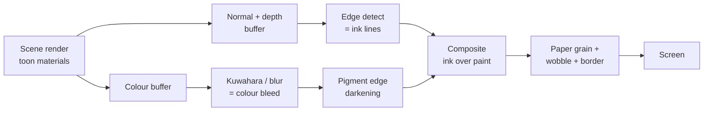
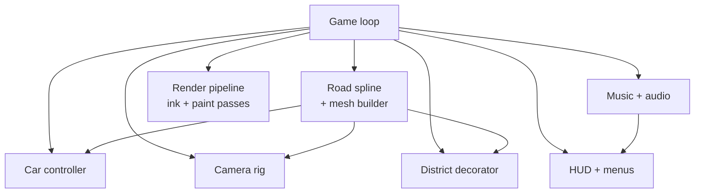

# Watercolor Road Game — Complete Build Plan (Three.js)

Sep 25, 2026 · @Lasa karu

## 1. Overview

We are building a browser-based 3D driving game in Three.js that looks like a hand-inked watercolour painting, where roads bend into the sky and driving through floating music notes plays each street's melody. The reference game ("Foldline — ink & wash roads") proves the concept works: a cosy, non-violent, low-stress drive that is part toy, part music box, part time-trial.

**One-line pitch:** "Paint the road. Then drive up it." A little rover with a gramophone on its roof drives through a paper town whose streets fold upward, loop, spiral and hang upside down, collecting notes that play a song.

**Design pillars** (every feature must serve at least one):

1. **It looks painted, not rendered.** Ink outlines, soft colour bleed, paper grain, wobbling "boiling" lines, a torn sketchbook border around the screen.
2. **The road is the level.** One continuous ribbon road that ignores normal gravity — it climbs walls, loops, corkscrews and runs across the ceiling of the sky.
3. **Driving makes music.** Notes on the road are pickups; each collected note plays in the street's key, and completed phrases fill a Songbook.
4. **Cosy first, challenge optional.** Free-drive with no fail state by default; a "Drive the song · beat the clock" time-trial mode with split times for players who want it.
5. **Instant in the browser.** Loads in under 10 seconds, runs 60 fps on a mid laptop, no install.

**Target:** desktop web first (keyboard), then gamepad, then touch/mobile. Single player. Session length 5–20 minutes. Audience: casual players, lofi/cosy-game fans, people who share pretty clips.

## 2. Reference analysis (what the videos show)

I sampled all three clips (43 s, 28 s and 57 s) every 3 seconds plus full-resolution stills of the title screen, the Studio panel and the time-trial HUD. The route is one continuous road through eight named districts, and each district change is announced with a big hand-lettered title card.

### Route order observed

| # | District name | What happens there | Road shape |
| --- | --- | --- | --- |
| 1 | Café Lane | Start street. Pastel houses, balconies, awnings, café stall, cypress and lemon trees, tram rails in the road | Straight, gently rising, 4 tram rails |
| 2 | The Yellow Wall | Tall yellow apartment blocks; tutorial banner "Steer through the notes" | Road starts to tilt upward |
| 3 | Ceiling Street | Road bends 90° up and runs across a giant floating wall/ceiling; windows look like small tiles below | Vertical climb then inverted plane |
| 4 | Bougainvillea Corkscrew | Tunnel of pink/orange flower bushes on black vines arching over the road | Corkscrew / helix |
| 5 | The Drop | Steep plunge between two teal water-slide-like walls | Near-vertical descent |
| 6 | Lemon Spiral | Elevated bridge spiralling over a painted sea; tiny island villages; lighthouse; paper boats | Wide banked spiral |
| 7 | The Blue Door Loop | Full vertical loop under a huge folded paper tree canopy; blue doors float by the road | Loop-the-loop |
| 8 | Möbius Arcade | Arch gate with bunting; road twists so the camera rolls | Möbius twist |

The top-right buttons (The Ride, Courtyard, Riverlight, The Home) are chapter/area jumps, so the full game has more zones than the ones shown.

### Frame-by-frame observations

- **Title screen (video 3, 0–3 s):** giant 3D letters spelling the title in mixed colours, a boombox prop, a tilted banner "Drive the song · beat the clock", a red SPACE → DRIVE button and a pill row of toggles: radio, daily, trophies, studio, new look, controls hint (A/D steer, jump, boost, all keys).
- **Intro card (image 5):** a paper card on the right with the pitch, a "Start with the radio on" checkbox, a big orange START THE ENGINE button and a keyboard legend (W/S throttle, A/D steer, Space hop, Shift boost, C camera, scroll zoom, \[ \] field of view, R radio, N next song, 1–6 time of day, P photo mode).
- **Driving (all clips):** chase camera 6–8 m behind and above the rover; the road fills the lower 60% of the frame; the horizon sits high; strong blue-violet cast shadows from trees and houses.
- **Notes:** coloured quavers and double-quavers (yellow, pink, blue, green) float in clusters and single lines above the road; collecting them bursts them into a spray of small notes around the car (image 6).
- **Pickups seen:** magnet (horseshoe), lightning bolt (boost), feather ("FEATHER" pop text, likely slow-fall), yellow glowing speed pads on the tarmac.
- **Air time:** pop text "AIR +22" and "AIR 1.1s · SEALED" after jumps — air time is scored.
- **Time trial HUD (video 3):** top-centre timer (0:03.17), lap and best time, delta vs best in green/red, per-street split cards bottom-centre ("Café Lane 0:05.70, −0.2 vs best"), and a status chip "17/280 · dawn · dreamy" (notes collected, time of day, mood).
- **Time of day:** clips show morning, golden, dusk (purple), night (lamps glow, headlights on) and rain (diagonal streaks).
- **Studio panel (video 2):** a live art-tuning panel with sliders for camera (FOV 100, distance 350, resolution %), ink & paint (ink strength, line weight, line crispness, sharpen, colour bleed, sketch lines, paper grain, glow, sketchbook border, line boil fps 24) and world & sound (wind, engine hum, music-box notes), plus "Play my song" and "New songbook". FPS readout (≈52–60).
- **Radio (bottom-left):** a yellow dial "88.3 MHz", station name (Paper Moon FM, Very Slow Waves 104.7), track x/08, progress bar, OFF / NEXT / BAND buttons.
- **Songbook strip (bottom-centre):** a row of mini staff thumbnails, one per phrase, filled with coloured dots as you collect ("6/40 · 0/5 phrases").
- **Speed card (bottom-right):** round gauge icon, 3-digit speed in km/h, district name, and buttons: Camera · Chase, Jev mode, Trophies, Chapters, Studio.
- **Ambient life:** red-haired girl in green dress, panda on a balcony, cats on railings, a chef figure, pedestrians, birds, falling petals, paper planes, floating rocks, floating mini-islands with houses, confetti-like paper bits in the sky.

### Problems visible in the reference (we must do better)

- The camera clips into tree canopies and fills the screen with one flat colour (video 3, Bougainvillea section).
- Falling off the road drops the camera under the water plane, showing a flat teal screen for \~2 s.
- District title text overlaps the road view and is hard to read on busy backgrounds.
- Frame rate dips to \~52 fps with all ink effects on at full resolution.

## 3. Art direction and the watercolour look

The look comes from four layers stacked in post-processing, not from painted textures: flat toon colour, inked outlines, watercolour bleed + paper, and a sketchbook frame. Get these four right and simple low-poly models will read as a painting.

### Visual rules

- **Shapes:** chunky low-poly, slightly crooked, nothing perfectly straight. Trees are faceted blobs (8–20 faces), houses are boxes with tilted roofs, lamps lean.
- **Colour:** flat fills with 2–3 tone bands, no realistic gradients. Warm terracotta roofs, pastel walls, lime/leaf greens, cobalt and teal water, cream paper.
- **Shadows:** coloured, never grey — blue-violet in daytime, deep indigo at night. Shadows are large and soft-edged, drawn like a wash.
- **Lines:** dark sepia/ink outlines of varying thickness; thicker on silhouettes, thinner on inner creases; lines "boil" (redraw with small jitter) 8–24 times per second.
- **Paper:** the whole frame sits on cream paper grain; highlights let the paper show through.
- **Frame:** a torn, deckled watercolour-paper border around the viewport, with the cream page colour behind the UI.

### Palette (starting point)

| Role | Hex | Use |
| --- | --- | --- |
| Paper | #F1ECDD | page, UI cards, highlights |
| Ink | #2B2622 | outlines, titles |
| Road | #9FA3D6 | road slabs (lavender-blue) |
| Road line | #F2D33B | centre dashes |
| Terracotta | #D2643A | roofs, kerbs, primary button |
| Leaf | #8CC63F | trees, bushes |
| Sea | #37C3C0 | water |
| Shadow | #6B6FB8 | cast shadow tint (day) |
| Bougainvillea | #D94A86 | flower accents |
| Lemon | #F4E04D | lemons, notes, glow |

### Rendering pipeline (per frame)

Read left to right: the scene is drawn once with toon materials, then every painterly effect is a full-screen pass.

1. **Toon materials.** Custom shader or `MeshToonMaterial` with a 3-step gradient map. Add a hatching/noise term in shadow areas so shadows look brushed. Tint the shadow colour by time of day.
2. **Ink outlines.** Render a normal+depth pass (a second cheap render or MRT). Run a Sobel/Roberts edge detector on depth and normals. Offset the sample positions with a noise texture that changes every "boil" tick so the lines wobble. Optionally add the inverted-hull method (back-face scaled mesh) on the car and hero props for bold silhouettes.
3. **Colour bleed.** A Kuwahara filter (4-sector, radius 3–6 px at half resolution) turns flat colour into brush-like patches. Then darken pixels where colour changes sharply ("edge darkening") — this is the key trick that makes watercolour pigment pool at the edges.
4. **Paper and wash.** Multiply by a tiling paper texture; add low-frequency noise that varies pigment density ("granulation"); subtle UV displacement from a noise map so edges look wet.
5. **Sketch lines.** Faint pencil construction lines drawn from a hatching texture in screen space, strongest in highlights.
6. **Glow.** Selective bloom for notes, lamps, speed pads and sunlight.
7. **Sketchbook border.** Final pass: a torn-edge alpha mask (a noise-thresholded vignette) blending to page colour.

Every one of these values must be a live slider in the Studio panel (section 9), exactly like the reference, because the art will be tuned by eye for weeks.

### Hand-painted details that sell it

- Sky is a large painted dome texture with brush clouds plus a few billboard cloud sprites that drift.
- Water uses a scrolling hand-drawn caustic line texture over a flat teal, with white foam doodles at shore edges.
- District titles are hand-lettered (a marker font), with a small Japanese subtitle above and a one-line poem below ("Round and round the painted tree").
- Decals: tyre skid marks, chalk doodles on the road, road cracks, bits of confetti.

## 4. World and track design

The whole world is built around one spline: a single continuous road ribbon, generated from control points, that everything else is placed along. Build the road tool first; every district is then "decorate this stretch of spline".

### The road as a spline

- Store the road as a list of control points, each with: position, **up-vector** (which way is "down" for the car), width, bank/roll angle, district id and tags (rails, kerb style, lamp spacing).
- Interpolate with a centripetal Catmull-Rom curve; compute frames with parallel transport (not Frenet) so loops and corkscrews don't flip.
- Generate the road mesh procedurally: slab tiles (UV grid for the paving pattern), kerbs, footpaths on both sides, orange guard rail on elevated parts, underside with thickness so it reads as paper folded into a ribbon.
- Centre line, tram rails and speed pads are separate strips that follow the same frames.
- Keep a lookup table: distance-along-road → position/frame, sampled every 0.5 m, for fast car snapping, note placement and camera.

### Districts (vertical slice = first 4, full game = 8 + chapters)

| District | Length | Road move | Props & mood | Music key / tempo |
| --- | --- | --- | --- | --- |
| Café Lane | 400 m | Straight, slight climb | Houses, café, balconies, lemon trees, pedestrians | C major, 90 bpm, warm |
| The Yellow Wall | 300 m | Climb to 60° | Tall towers, vines, laundry lines | G major, 96 bpm |
| Ceiling Street | 350 m | 90° up, then inverted | Windows as floor tiles, upside-down houses | E minor, 100 bpm, dreamy |
| Bougainvillea Corkscrew | 250 m | 2-turn helix | Flower arches on vines, petals | D major, 104 bpm |
| The Drop | 200 m | 70° plunge | Teal slide walls, splash spray | A minor, 110 bpm, tense |
| Lemon Spiral | 500 m | Banked spiral over sea | Lighthouse, islands, paper boats | F major, 92 bpm, breezy |
| The Blue Door Loop | 300 m | Vertical loop | Giant folded tree, floating blue doors | Bb major, 98 bpm |
| Möbius Arcade | 300 m | Half-twist | Bunting gate, lanterns | C major, 100 bpm, finale |

### Level-building rules

- **Show the future:** from almost every point the player should see a later part of the road in the sky (loops, spirals, the Ceiling). This is the game's main "wow" and navigation aid.
- **Every 20–30 seconds** of driving, a new title card and a new road trick.
- **Rest stretches:** after each big trick, 10 seconds of straight, easy road.
- **Density:** street districts have props every 3–6 m on both sides; sky districts go sparse and let the sea and islands do the work.
- **Background layers:** floating islands with tiny towns, floating rocks, giant colour-block "paper strips" hanging from the sky, distant cloud cards. All are cheap instanced low-poly or billboards.
- **Safety net:** the road has invisible side walls on high sections. If the car still falls, fade the paper border inward, show a small "splash" doodle and respawn on the road at the last checkpoint within 1.5 s — never show the camera underwater.

### Chapters and hub

The reference has chapter jumps (The Ride, Courtyard, Riverlight, The Home). Plan for 4 chapters of 6–8 districts each, unlocked by collecting phrases. Chapter 1 is the vertical slice above.

## 5. Vehicle and driving feel

Use arcade "road-relative" physics, not a real physics engine: gravity always points to the road's local down, so the car sticks to loops, walls and ceilings. This is the single most important system after rendering.

### The rover

- Boxy cream-white off-roader, big chunky tyres with yellow hubs, red rear wing, roof rack carrying a brass gramophone horn, antenna, jerry can, spare wheel and a small figure. Around 3,000–6,000 triangles.
- Separate parts for animation: body (tilts and bounces), 4 wheels (spin and steer), gramophone horn (pulses with the beat), antenna (springs), brake lights (light up when braking).
- 2–3 unlockable paint schemes and roof loads ("new look" button on title screen).

### Movement model

The car's state is: distance along road `s`, lateral offset `x` (−half-width to +half-width), speed `v`, vertical offset `h` above road, vertical speed.

- **On ground:** position = road point at `s` + road right-vector × `x` + road up × `h`. Orientation = road frame, plus visual yaw from steering and a small body roll.
- **Throttle / brake:** accelerate toward max speed (≈180 km/h shown), coast down slowly, brake fast. Reverse slowly.
- **Steer:** changes lateral velocity; stronger at low speed, softer at high speed. Kerbs push the car back in with a bump.
- **Hop (Space):** sets vertical speed; the car flies along road-up and lands back on the road. Air time counts up ("AIR +22"). A clean landing gives a small boost.
- **Boost (Shift):** uses a boost meter filled by notes and air time; FOV widens, speed lines, exhaust puffs.
- **Speed pads:** glowing yellow strips give an instant boost.
- **Gravity rule for loops:** below a minimum speed on steep/inverted sections, gently auto-accelerate rather than letting the car fall. Cosy game — nobody should get stuck.
- **Free-fall:** only off deliberate gaps or edges. If off-road for > 1.2 s, respawn (section 4).

### Pickups

| Pickup | Look | Effect |
| --- | --- | --- |
| Note | Coloured quaver | Plays a melody step, +1 boost, counts toward phrase |
| Magnet | Horseshoe | Pulls notes within 8 m for 10 s |
| Bolt | Lightning | Fills boost meter |
| Feather | Paper feather | Long, floaty hops for 8 s |
| Speed pad | Glowing strip | Instant speed burst |

### Juice (feel details)

- Suspension bounce on landing, squash on the body for 100 ms.
- Tyre dust puffs as ink-and-wash sprites; petals kicked up in flower districts.
- Camera shake only on big landings (small amplitude).
- Short text pops above the car in hand-lettering ("AIR 1.1s", "FEATHER", "WOBBLY").
- The engine hum pitches up with speed and ducks under music.

### Controls

| Action | Keyboard | Gamepad | Touch |
| --- | --- | --- | --- |
| Throttle / brake | W / S | RT / LT | Right / left pedal zones |
| Steer | A / D | Left stick | Tilt or drag |
| Hop | Space | A | Tap button |
| Boost | Shift | X | Tap button |
| Camera mode | C | Y | Button |
| Zoom / FOV | Scroll / \[ \] | Right stick | Pinch |
| Radio / next song | R / N | D-pad | Radio card |
| Time of day | 1–6 | Bumpers | Top bar |
| Photo mode | P | Select | Button |

## 6. Camera system

The camera follows the road, not the world: its "up" blends toward the road's up-vector so loops and ceilings feel natural, and it looks ahead along the spline so the player always sees the next trick.

### Modes (C cycles)

| Mode | Distance / height | Use |
| --- | --- | --- |
| Chase (default) | 7 m behind, 3 m up | Normal driving |
| Low | 4 m behind, 1.2 m up | Speed feel, clips |
| High | 12 m behind, 8 m up, looks down | Seeing the notes ahead (video 3 view) |
| Cinematic | Fixed rails per district | Title cards, attract mode |
| Photo mode | Free orbit, pauses game | Screenshots with frame + stamp |

### Rules

- **Look-ahead:** target point = car position + 12–25 m further along the spline (more at high speed).
- **Up-vector blending:** slerp camera up toward road up at \~2–4 per second; faster in loops so the horizon doesn't lag.
- **Smoothing:** critically-damped springs for position and target; no hard snaps except respawn.
- **FOV:** 70–100° (slider), +8° during boost.
- **Collision (fixes the reference bug):** sphere-cast from car to camera against a simple collision layer (tree canopies, walls, arches). If blocked, pull the camera in; also fade/dither any foliage within 3 m of the camera to 30% so the screen never fills with one flat colour.
- **Water:** clamp the camera above sea level + 1 m at all times.
- **District intros:** on entering a district, ease out 20% in distance for 2 s while the title card shows.

## 7. Music system: notes, Songbook and radio

Music is the reward loop: every note you drive through plays the next step of the district's melody, so a clean line through the notes literally plays a song, and a messy line plays a broken one. Build this with the Web Audio API (or Tone.js) — all synthesised or sampled music-box sounds, quantised to the beat.

### How notes work

- Each district has a melody of 32–64 steps written in data (pitch, duration, colour). Notes on the road are placed from that melody: higher pitch = higher above the road or further left/right, so the note layout draws the melody's shape.
- Collecting a note plays its pitch on a music-box/celesta sample, **quantised to the next 1/8 beat** of a soft backing loop so it always sounds musical.
- Note colour = pitch class (e.g., C yellow, D pink, E blue, G green) — consistent across the game so players learn it.
- A phrase = 8 consecutive melody steps. Collect all 8 → the phrase "seals" (chime, burst of notes, Songbook slot fills).
- Missed notes leave a gap; the backing loop keeps playing, so nothing ever sounds wrong enough to punish.

### Songbook (bottom-centre strip)

- One small staff card per phrase (e.g., 5 per district, 40 per chapter), shown as a row of thumbnails.
- Dots appear on the staff as you collect; sealed phrases get a colour wash.
- Counter: "notes 17/280 · phrases 3/35".
- **Play my song:** plays back your personal version — exactly the notes you caught, in order — as a shareable little tune.
- **New songbook:** reseeds melodies procedurally (same scale, new tune) for replay value.
- **Daily:** one seeded songbook per day, same for all players.

### Radio (bottom-left card)

- Stations with names and frequencies (e.g., 88.3 Paper Moon FM — lofi; 104.7 Very Slow Waves — ambient). 6–8 tracks per station.
- The radio track is the backing loop: it is written in the same key and tempo as the district so collected notes harmonise. Crossfade to the next district's key at title cards.
- Buttons: OFF, NEXT, BAND. With radio off, notes play over a quiet pad only.
- The gramophone horn on the car pulses with the beat; radio on = small floating notes drift out of it.

### Sound layers

| Layer | Source | Notes |
| --- | --- | --- |
| Radio / backing | Streamed OGG/MP3 loops, 90–110 bpm | License or commission; keep stems per key |
| Note hits | Music-box sample, pitched | Quantised, slight random velocity |
| Engine hum | Synth oscillator + noise | Pitch follows speed; slider |
| Wind | Filtered noise | Louder in sky districts and at speed; slider |
| World | Birds, waves, café chatter, rain | Per-district ambience beds |
| UI | Paper rustles, pencil ticks, stamp | Every button |

Audio must start only after the first user click/key (browser autoplay rules), which the START THE ENGINE button handles.

## 8. Time of day, weather and lighting

Six time-of-day presets plus Auto and Rain, exactly like the reference top bar (Dawn, Morning, Noon, Golden, Dusk, Night, Auto, Rain). Each preset is just a set of numbers blended over 2 seconds; no baked lighting.

| Preset | Sky top → horizon | Sun colour / angle | Shadow tint | Extras | Mood tag |
| --- | --- | --- | --- | --- | --- |
| Dawn | lilac → peach | pale pink, 8° | violet | mist near sea | dreamy |
| Morning | sky blue → cream | warm white, 30° | blue-violet | birds | bright |
| Noon | cyan → white | white, 70° | cool blue, short | heat shimmer | clear |
| Golden | amber → rose | orange, 15° | purple | long shadows, bloom up | warm |
| Dusk | purple → coral | magenta, 3° | indigo | lamps switch on | wistful |
| Night | navy → teal | moon blue, 40° | deep indigo | lamps, headlights, lit windows, stars | quiet |

- **Auto:** a full day cycle in \~12 real minutes; the clock in the top-left shows game time (09:30 MORNING).
- **Rain:** diagonal ink streaks (screen-space), darker wetter paper wash, puddle reflections as flat light patches, lower saturation, rain ambience, wipers-style sound. Can combine with any time preset.
- **Lights at night:** street lamps and windows are emissive + bloom; use a few real point lights near the car only, and fake the rest with glow sprites to keep performance.
- Time of day also changes the music filter (darker, slower pads at night) and the mood tag shown in the status chip.

## 9. UI, HUD and screens

All UI is HTML/CSS layered over the canvas, styled as paper cards: cream fill, thin ink border, slight drop shadow, a hand-lettered display font for titles and a small uppercase mono/sans for labels. Keep the four corners and the centre-bottom for HUD; the middle of the screen stays clear for the road.

### HUD layout (in-game)

| Position | Element | Contents |
| --- | --- | --- |
| Top-left | Logo + clock | Logo mark, game name, subtitle, clock "09:30 MORNING" |
| Top-left bar | Time-of-day pills | Dawn … Night, Auto, Rain (active one filled black) |
| Top-centre | Timer (trial mode only) | Current time, lap, best, delta; status chip "notes · time · mood" |
| Top-right | Chapter buttons | The Ride, Courtyard, Riverlight, The Home |
| Centre | District title card | Small Japanese line, big hand-lettered name, poem line; fades in 0.4 s, holds 2 s, fades out |
| Bottom-left | Radio card | Yellow dial with MHz, station, track n/8, progress, OFF / NEXT / BAND |
| Bottom-centre | Songbook strip | Phrase thumbnails, counters; boost/wobbly status pills above it |
| Bottom-centre (trial) | Split card | Last district split, delta vs best |
| Bottom-right | Speed card | Speed gauge, km/h, district name, buttons: Camera, mode, Trophies, Chapters, Studio |

Fix from the reference: put a soft paper backing behind district titles so they read over busy scenes.

### Screens

1. **Loading:** a pencil drawing of the rover being inked in as a progress bar.
2. **Title:** big 3D letters of the logo standing in the street, boombox, banner "Drive the song · beat the clock", SPACE → DRIVE button, pill row (radio, daily, trophies, studio, new look, controls).
3. **Intro card:** pitch text, "Start with the radio on" checkbox, START THE ENGINE button, key legend.
4. **Studio panel:** slide-in right panel. Sections: Camera (FOV, distance, resolution %, auto-balance to hold 60 fps), Ink & paint (ink strength, line weight, line crispness, sharpen, colour bleed, sketch lines, paper grain, glow, sketchbook border, line boil fps), World & sound (wind, engine hum, music-box notes), buttons Play my song / New songbook, FPS readout. Save to local storage.
5. **Trophies:** a sticker album page (e.g., "Seal every phrase in Lemon Spiral", "2 s air time", "Drive the whole chapter at night in the rain").
6. **Chapters:** a folded paper map showing chapters and districts, with best times and phrase counts.
7. **Photo mode:** free camera, hide HUD, frame styles (sketchbook, postcard, polaroid), stamp with district and time, save PNG.
8. **Pause:** paper card with Resume, Restart district, Settings, Controls, Quit to title.
9. **Settings:** graphics preset (Low/Medium/High/Ultra), volume per layer, invert controls, reduced motion (no line boil, no camera roll), colour-blind safe note shapes.

## 10. Characters, props and life in the world

The world feels alive through many tiny, cheap animated things rather than a few complex ones. Characters are simple blocky figures (head, body, arms) with 2–4 frame idle animations and a reaction when the rover passes.

### Character list

| Character | Where | Behaviour |
| --- | --- | --- |
| Red-haired girl, green dress | Kerbside, many districts | Waves, turns head to follow the car |
| Panda on balcony | Café Lane | Leans on railing, sways to the radio |
| Cats (grey, black) | Railings, walls, spiral bridge | Sit, tail flick, jump away if hopped near |
| Chef | Café stall | Flips a pan; notes pop out |
| Man in straw hat | Ceiling Street | Walks upside down with the road |
| Yellow-coat walker | Möbius Arcade | Leans into the wind |
| Birds, gulls | Sky districts | Flocks that scatter from the car |

### Prop kit (build once, reuse everywhere)

- **Buildings:** 6 house shells × 4 roof types × 8 colours, balconies, shutters, awnings, flower boxes, steps, doors. Tall tower blocks with window grids and vines.
- **Street:** street lamps (leaning), benches, A-frame chalk signs, bins, bollards, café tables, planters, laundry lines.
- **Nature:** cypress, round lemon tree, faceted oak, bushes, bougainvillea arches, potted plants.
- **Sky:** floating rocks, mini-islands with villages, hanging paper strips, bells, clouds, lighthouse.
- **Particles:** petals, leaves, paper planes, paper boats, confetti, small music notes, dust puffs, rain.

Use `InstancedMesh` for every repeated prop and a seeded random placer along the spline so districts can be decorated fast and still look hand-placed.

## 11. Technical architecture, performance and assets

Recommended stack: Three.js (WebGL2, with WebGPU renderer as a later upgrade), TypeScript, Vite, `postprocessing` library for the effect chain, Tone.js or raw Web Audio, lil-gui during development for the Studio panel, and plain HTML/CSS for the HUD. No heavy physics engine is needed.

### Module map

The road spline is the shared backbone: the car, camera, notes and decoration all ask it "where is distance s?".

### Data-driven content

- One JSON file per district: control points, width, tags, prop placement rules (density, which kit pieces, seed), melody steps, key/tempo, title texts, ambience, pickups.
- A small in-browser track editor (dev-only) to drag control points, set up-vectors and preview. This saves months.

### Performance budget (mid laptop, 1080p, 60 fps)

| Item | Budget |
| --- | --- |
| Draw calls | < 250 (instancing, merged static geometry per district chunk) |
| Triangles on screen | < 800k |
| Post passes | 5–6, most at half resolution (Kuwahara, bloom, edge detect) |
| Textures | < 150 MB GPU; KTX2/Basis compressed; paper + noise textures shared |
| Download (first play) | < 15 MB before driving; stream later districts |
| Frame time | 16.6 ms; CPU logic < 4 ms |

- **Chunking:** split the road into \~100 m chunks; only the current ±3 chunks are fully detailed; far chunks use simplified meshes; the distant "road in the sky" uses a cheap ribbon LOD.
- **Dynamic resolution:** the "auto-balance to hold 60 fps" option lowers render scale 100% → 60% before dropping effects.
- **Quality presets:** Low (no Kuwahara, lines at half res, no boil), Medium, High, Ultra (full res ink, shadows 2048).
- **Shadows:** one directional light, cascaded or a single shadow map following the car; shadows are tinted in the toon shader.
- **Mobile:** Low preset, 30 fps cap, touch controls, reduced prop density.

### Asset pipeline

- Model in Blender, low-poly, vertex colours or 1 small palette texture per kit (no unique textures).
- Export glTF/GLB with Draco or Meshopt compression.
- Paper, grain, brush, hatching and noise textures made once (can be scanned from real watercolour paper).
- Fonts: one hand-lettered display font + one small caps UI font, self-hosted, subset to used characters.
- Audio: OGG + AAC fallback, loops cut on bar lines.

### Save data

Local storage (or IndexedDB): Studio settings, best times per district, notes and phrases collected, trophies, chosen car look, radio station. Optional later: online leaderboard for the daily songbook.

## 12. Roadmap, team, risks and success checklist

Build in the order that proves the hardest things first: the watercolour look and the road-sticking car. If those two feel great in a grey-box street by week 4, the rest is content.

### Milestones (small team, \~6 months)

| Phase | Weeks | Goal | Done when |
| --- | --- | --- | --- |
| 0. Look test | 1–2 | Ink + watercolour + paper passes on a few test boxes and trees | A still screenshot looks painted; Studio sliders work |
| 1. Road + car | 3–5 | Spline road generator, road-relative car, chase camera, loop and ceiling test track | Driving a loop and an upside-down street feels smooth at 60 fps |
| 2. Music core | 6–7 | Notes placed from melody, quantised playback, phrase sealing, radio loop | Driving a clean line plays a recognisable tune |
| 3. Vertical slice | 8–12 | Café Lane → Bougainvillea Corkscrew fully dressed; HUD; title + intro | Outsiders play it and ask "what comes next?" |
| 4. Content | 13–20 | Remaining 4 districts, time-of-day, rain, characters, pickups, time trial | Chapter 1 complete end to end |
| 5. Polish + perf | 21–24 | Quality presets, mobile, audio mix, trophies, photo mode, daily songbook | 60 fps on target laptop; < 15 MB first load |
| 6. Launch | 25–26 | Website, itch.io / own domain, trailer, analytics | Public release |

### Team (minimum)

- 1 graphics/gameplay programmer (Three.js, shaders).
- 1 3D artist (low-poly kit, rover, characters) who also does level dressing.
- 1 composer/sound designer (part-time): radio tracks, music-box samples, ambience.
- 1 designer/producer (can be the programmer): tracks, melodies, tuning, testing.

### Top risks

| Risk | Why it matters | Mitigation |
| --- | --- | --- |
| Watercolour look too slow | Kuwahara + edges at full res costs a lot | Half-res passes, presets, dynamic resolution; test on a weak laptop from week 1 |
| Look becomes muddy or noisy | Too many effects fight | Tune with Studio sliders; reference screenshots side by side; keep flat colour areas large |
| Motion sickness in loops | Camera rolling + boiling lines | Reduced-motion setting, slower up-vector blend option, stable horizon mode |
| Car snapping feels fake | Road-relative physics can feel on rails | Allow lateral freedom, hops, drift visuals, suspension juice |
| Music sounds random | Players miss notes | Quantise to beat, backing loop in key, forgiving pickup radius (1.5 m) |
| Content takes too long | Hand-placing props | Seeded procedural dressing + dev track editor |
| Copying the reference too closely | Legal and identity risk | Own name, own logo, own district names, own characters and music; use this game only as style inspiration |

### Success checklist

- [ ] A single still frame is recognisable as "watercolour" to someone who has never seen the game.
- [ ] 60 fps on a 3-year-old mid laptop at the High preset.
- [ ] Loads to title screen in under 10 seconds on normal broadband.
- [ ] A new player drives a full loop and an upside-down street in the first 2 minutes without getting stuck.
- [ ] Driving a clean line through notes plays a melody people hum afterwards.
- [ ] The camera never clips into foliage and never goes underwater.
- [ ] District titles are readable on every background.
- [ ] Every Studio slider changes the image live and saves.
- [ ] Time trial shows splits and deltas per district.
- [ ] Photo mode produces a shareable framed PNG.
- [ ] Playtest: 8 of 10 testers say it feels "relaxing" and would share a clip.

**Next step:** start Phase 0 — build one Café Lane house, one tree, the rover and a 50 m straight road, and push the ink + watercolour passes until that single scene looks like image 2 of the reference.
